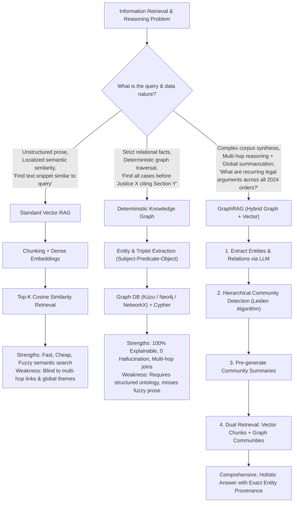
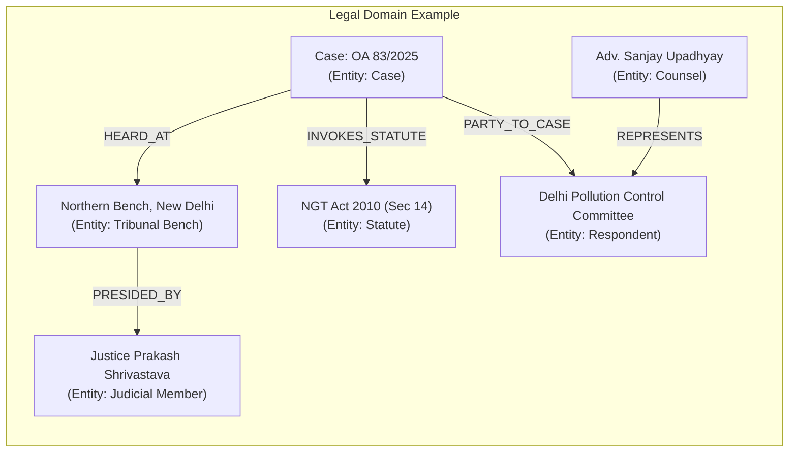
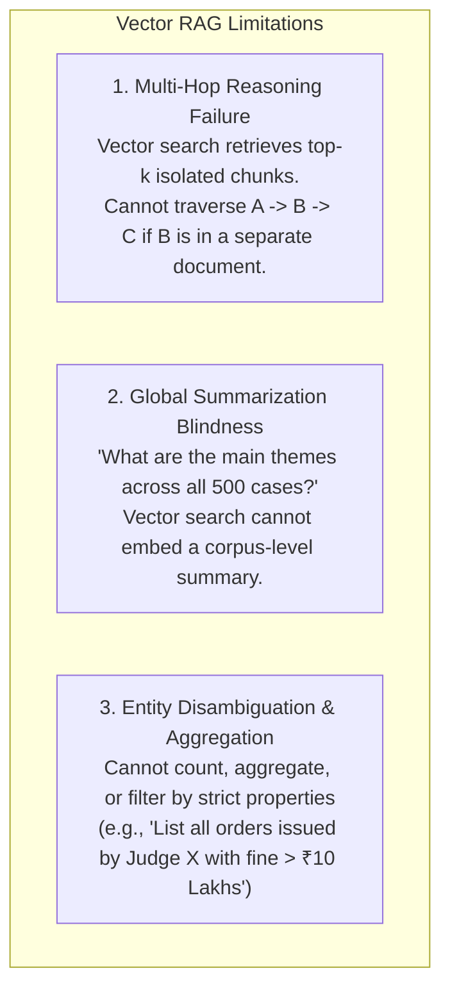
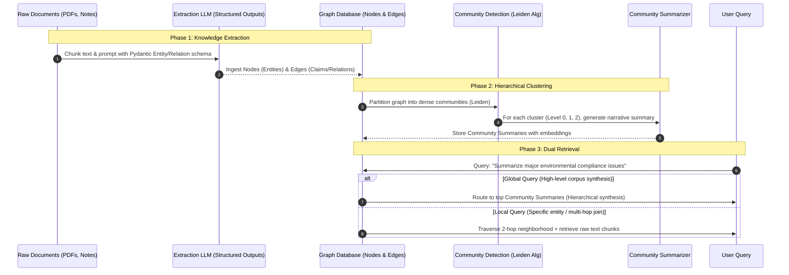
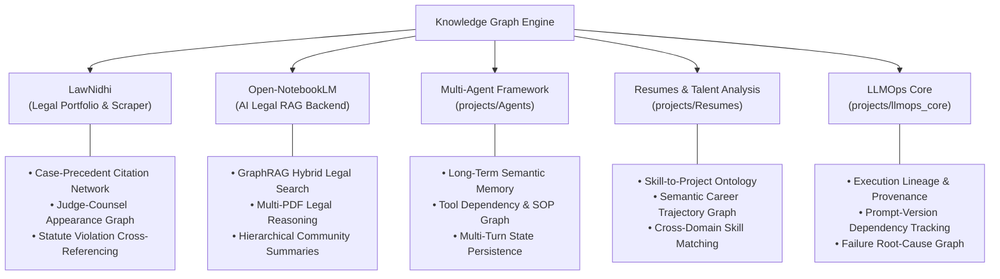
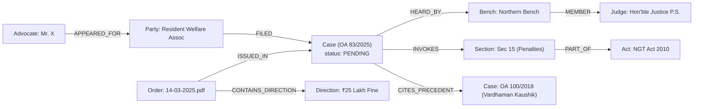
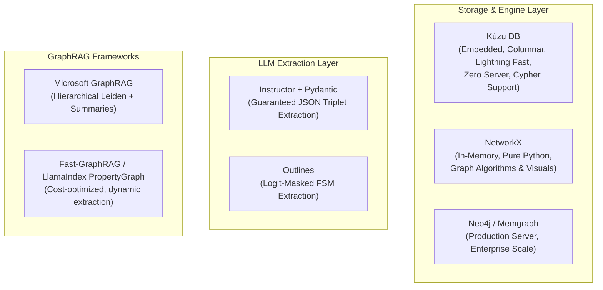
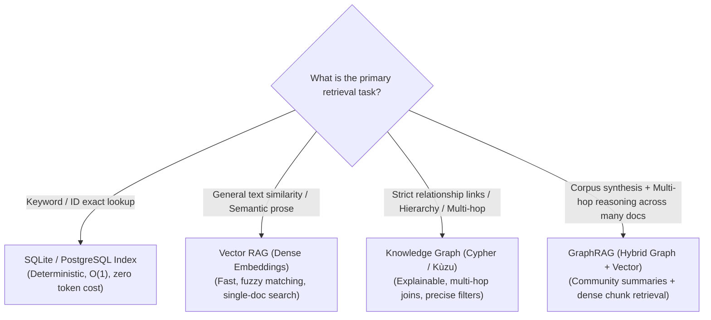

# Knowledge Graphs & GraphRAG: Architecture, Mechanics, and Practical Applications

**Topic:** Comprehensive guide to Knowledge Graphs (KGs), GraphRAG (Hybrid Graph + Vector RAG), graph construction pipelines, and their practical application across active workspace projects.

---

## 📊 Visual Summary & Decision Architecture



---

## 1. What is a Knowledge Graph?

A **Knowledge Graph (KG)** is a structured representation of real-world knowledge where **entities** (nodes) and their **relationships** (edges) are modeled as a network with explicit semantic meaning.

### 1.1 The Core Primitive: The Semantic Triplet

Every fact in a knowledge graph is fundamentally expressed as a **Subject-Predicate-Object (SPO)** triplet:

$$\text{(Subject)} \xrightarrow{\text{Predicate / Relationship}} \text{(Object)}$$



### 1.2 Property Graphs (LPG) vs. RDF Ontologies

In modern AI and software engineering, two primary graph data models exist:

| Dimension | Labeled Property Graph (LPG) | RDF / Semantic Web (Resource Description Framework) |
| :--- | :--- | :--- |
| **Philosophy** | Pragmatic, developer-friendly, performance-oriented | Academic, formal ontology, globally unique URIs |
| **Node/Edge Attributes** | Nodes and Edges can have arbitrary Key-Value properties | Everything is an atomic URI or Literal triplet |
| **Primary Tools** | **Kùzu** (embedded), **Neo4j**, **Memgraph**, **NetworkX** | Apache Jena, Ontotext GraphDB, Protégé, Stardog |
| **Query Language** | **Cypher** / openCypher, GQL | **SPARQL** |
| **Standard Format** | JSON-LD, GraphML, Parquet/Arrow tables | Turtle (`.ttl`), N-Triples, RDF/XML |
| **Best Used For** | Fast application backends, LLM agents, GraphRAG | Formal taxonomies, medical ontologies, linked open data |

> [!NOTE]
> **Workspace Recommendation:** For Python-based agentic and LLM applications, the **Labeled Property Graph (LPG)** model using embedded engines like **`Kùzu`** (zero-overhead, embedded columnar graph database like DuckDB for graphs) or **`NetworkX`** (in-memory) is preferred over heavy RDF triplestores.

---

## 2. Why Pure Vector RAG Fails (And How Graphs Fix It)

While dense vector embeddings (like OpenAI `text-embedding-3`, BGE, or MiniLM) excel at semantic similarity, they suffer from critical architectural blind spots:

### 2.1 The 3 Failure Modes of Vector RAG



### 2.2 Vector RAG vs. Graph vs. GraphRAG Comparison

| Capability | Vector RAG | Pure Knowledge Graph | GraphRAG (Hybrid) |
| :--- | :--- | :--- | :--- |
| **Fuzzy Semantic Search** | 🟢 Excellent | 🔴 Poor (Keyword / Exact match only) | 🟢 Excellent (Vector chunks) |
| **Multi-Hop Traversal** | 🔴 Blind | 🟢 Deterministic & Fast | 🟢 Graph-guided context retrieval |
| **Global Dataset Summaries** | 🔴 Fails (Context window overflow) | 🟡 Complex query writing | 🟢 Hierarchical Community Summaries |
| **Structured Aggregation** | 🔴 Hallucinates counts / filters | 🟢 Exact Cypher/SQL aggregations | 🟢 Combines structured stats + text |
| **Provenance & Explainability** | 🟡 Chunk references only | 🟢 Explicit edge lineage | 🟢 Dual grounding (Edges + Chunks) |
| **Ingestion Cost & Overhead** | 🟢 Low (Single embedding pass) | 🟡 Moderate (Entity extraction) | 🔴 Higher (LLM extraction + clustering) |

---

## 3. The GraphRAG Pipeline: How It Works

**GraphRAG** (pioneered by Microsoft Research and graph AI researchers) transforms unstructured documents into a structured, queryable knowledge network before retrieval.



### 3.1 Local Search vs. Global Search in GraphRAG

1. **Local Search (Entity-Centric)**:
   - Identifies candidate entities mentioned in the query.
   - Traverses the 1-hop and 2-hop graph neighborhood (neighbor entities, relationships, raw text chunk citations).
   - *Example:* "What was the final ruling regarding the respondent Delhi Pollution Control Committee in OA 83/2025?"
2. **Global Search (Corpus-Centric)**:
   - Does *not* rely on single entity matching.
   - Retrieves pre-computed **Community Summaries** across higher-level graph clusters.
   - Performs a map-reduce synthesis across community reports.
   - *Example:* "What are the common legal justifications for reducing environmental compensation across all cases in 2024?"

---

## 4. Application Analysis: Where Can You Use Knowledge Graphs in Your Projects?

Below is a systematic breakdown of how Knowledge Graphs and GraphRAG can be directly applied to the existing codebases in your workspace.



---

### 4.1 Project 1: LawNidhi (`projects/LawNidhi`)

#### 🎯 Problem in Current Architecture
LawNidhi currently stores tabular case metadata in SQLite (`lawnidhi.db`) and downloads raw PDF orders. While SQLite handles standard relational filtering (`WHERE status = 'OPEN'`), it cannot answer:
- *"Which judicial precedents are most frequently cited by the Northern Bench when dealing with solid waste management?"*
- *"Find all instances where Senior Counsel A appeared against Respondent B before Bench C."*
- *"Show the chronological chain of orders leading up to the final judgment in Appeal 12/2023."*

#### 💡 The Legal Knowledge Graph Solution
Model LawNidhi's domain entities into a rich Property Graph:



#### 🚀 Practical Impact for LawNidhi
1. **Precedent Citation Mapping**: Automatically link orders to cited Supreme Court / High Court / NGT precedents extracted via LLM.
2. **Conflict of Interest & Bench Analytics**: Instant traversal to detect past appearances and judicial trends.
3. **Zero-Inference Structured Filtering**: Combine SQLite fast-lookup with Graph traversals for instantaneous multi-hop querying.

---

### 4.2 Project 2: Open-NotebookLM (`projects/Open-NotebookLM`)

#### 🎯 Problem in Current Architecture
Open-NotebookLM acts as the RAG backend for LawNidhi orders. Currently, it chunks PDFs into vector embeddings. When a user asks:
- *"Summarize the overarching dispute between the petitioner and the State Pollution Control Board across all 15 orders in this case."*
The vector retriever fetches isolated 500-token chunks that miss the big-picture progression of hearings.

#### 💡 The GraphRAG Solution
Integrate **GraphRAG** into `workflow_engine/` alongside the existing vector index:
1. **Dual Indexing**: When an order PDF is uploaded:
   - Generate vector embeddings for text chunks (semantic similarity).
   - Extract legal entities, claims, and rulings into an embedded graph (`Kùzu` or `NetworkX`).
2. **Community Summaries**: Generate cluster summaries for each legal dispute topic.
3. **Hybrid Answer Synthesis**: Combine the specific chunk evidence with the global graph summary.

---

### 4.3 Project 3: Multi-Agent AI Framework (`projects/Agents`)

#### 🎯 Problem in Current Architecture
Agents rely on token-limited conversation history and static SOP markdown files. Long-running tasks face context window saturation and lose long-term semantic context.

#### 💡 The Knowledge Graph Solution: Agent Semantic Memory & SOP Graphs
1. **Long-Term Memory Graph**: Store facts discovered during execution (e.g., table schemas, column data types, business rules) as graph nodes. The agent queries its memory graph instead of re-reading raw files or consuming context tokens.
2. **Dynamic Tool & SOP Dependency Graph**: Instead of linear SOP files, model procedural steps as a Directed Acyclic Graph (DAG) of prerequisites, validations, and recovery routes.

---

### 4.4 Project 4: Resumes & Talent Analysis (`projects/Resumes`)

#### 🎯 Problem & Opportunity
Resumes (`master_resume.md`, `detailed_resume.md`, `resume.json`) contain rich, interconnected professional histories:
- Skills (e.g., PyTorch, Agentic AI, FastAPI)
- Projects (e.g., LawNidhi, Open-NotebookLM)
- Impacts (e.g., Latency reduction, Cost optimization)
- Domains (e.g., LegalTech, LLMOps, NLP)

#### 💡 The Skill & Experience Graph
A graph allows:
- **Transferable Skill Inference**: A query for "Distributed Systems" automatically matches candidates with "Kafka + Celery + Kubernetes" because the graph contains the parent category relationships.
- **Tailored Resume Generation**: Automatically generate customized resume views by pruning graph subtrees relevant to a specific job description.

---

## 5. Technology Stack & Implementation Guide

### 5.1 Recommended Tooling Ecosystem



### 5.2 Recommended Python Stack for Your Workspace

| Layer | Tool | Why It Fits Your Workspace |
| :--- | :--- | :--- |
| **Embedded Graph DB** | **`kuzu`** (`pip install kuzu`) | Runs in-process like SQLite (no Docker/server required), supports openCypher, ultra-fast columnar storage. Perfect match for LawNidhi's SQLite architecture. |
| **Algorithm & In-Memory** | **`networkx`** (`pip install networkx`) | Native Python graph library for clustering, shortest paths, centrality, and visualization. |
| **Entity Extraction** | **`pydantic` + `instructor`** | Enforces strict typed schemas for `(subject, predicate, object)` triplets without regex parsing. |

---

## 6. Hands-On Code Blueprint: Building a Knowledge Graph with Pydantic & Kùzu

Here is a self-contained, production-ready implementation blueprint demonstrating how to extract triplets with Pydantic and store/query them in an embedded graph.

### 6.1 Step 1: Define the Structured Extraction Schema

```python
"""schema.py: Structured extraction schema for Knowledge Graph triplets."""
from typing import List, Literal
from pydantic import BaseModel, Field


class Entity(BaseModel):
    id: str = Field(description="Unique, normalized identifier (e.g. 'law_ngt_act_2010')")
    name: str = Field(description="Display name (e.g. 'National Green Tribunal Act 2010')")
    entity_type: Literal[
        "CASE", "JUDGE", "BENCH", "COUNSEL", "PARTY", "STATUTE", "ORDER", "PENALTY"
    ] = Field(description="Category of the entity")


class Relationship(BaseModel):
    source_id: str = Field(description="ID of the source entity")
    relation_type: Literal[
        "HEARD_AT", "PRESIDED_BY", "REPRESENTS", "PARTY_TO", 
        "INVOKES_STATUTE", "CITES_PRECEDENT", "ISSUED_DIRECTION"
    ]
    target_id: str = Field(description="ID of the target entity")
    weight: float = Field(default=1.0, description="Confidence or frequency score")


class KnowledgeGraphExtraction(BaseModel):
    """Container for all extracted graph elements from a text passage."""
    entities: List[Entity] = Field(default_factory=list)
    relationships: List[Relationship] = Field(default_factory=list)
```

### 6.2 Step 2: Ingest & Query with Kùzu (Embedded Cypher Graph)

```python
"""graph_store.py: Ingest extracted entities and run Cypher queries using Kùzu."""
import kuzu
import shutil
import os


class LegalGraphEngine:
    def __init__(self, db_path: str = "./legal_graph_db"):
        self.db = kuzu.Database(db_path)
        self.conn = kuzu.Connection(self.db)
        self._init_schema()

    def _init_schema(self):
        """Create node and relationship tables if they don't exist."""
        # Define Entity Node Table
        self.conn.execute("""
            CREATE NODE TABLE IF NOT EXISTS LegalEntity(
                id STRING,
                name STRING,
                entity_type STRING,
                PRIMARY KEY (id)
            )
        """)
        # Define Rel Table
        self.conn.execute("""
            CREATE REL TABLE IF NOT EXISTS RelatesTo(
                FROM LegalEntity TO LegalEntity,
                relation_type STRING,
                weight DOUBLE
            )
        """)

    def insert_graph_data(self, data: KnowledgeGraphExtraction):
        """Insert extracted nodes and edges into Kùzu."""
        # Insert Nodes
        for ent in data.entities:
            self.conn.execute(
                "MERGE (n:LegalEntity {id: $id}) "
                "ON CREATE SET n.name = $name, n.entity_type = $type",
                {"id": ent.id, "name": ent.name, "type": ent.entity_type}
            )
        # Insert Edges
        for rel in data.relationships:
            self.conn.execute(
                "MATCH (a:LegalEntity {id: $src}), (b:LegalEntity {id: $tgt}) "
                "MERGE (a)-[r:RelatesTo {relation_type: $rel}]->(b)",
                {"src": rel.source_id, "tgt": rel.target_id, "rel": rel.relation_type}
            )

    def find_connected_precedents(self, case_id: str):
        """2-Hop traversal: Find all precedents and statutes connected to a case."""
        query = """
            MATCH (c:LegalEntity {id: $case_id})-[r1:RelatesTo]->(target:LegalEntity)
            OPTIONAL MATCH (target)-[r2:RelatesTo]->(sub_target:LegalEntity)
            RETURN target.name, r1.relation_type, sub_target.name, r2.relation_type
        """
        response = self.conn.execute(query, {"case_id": case_id})
        return response.get_as_df()
```

---

## 7. Strategic Recommendations & Roadmap

In accordance with workspace rules regarding Scope Management, the following roadmap is suggested for planning future enhancements without immediate scope creep:

### Suggested Backlog Items (`specs/backlog.md`)

- [ ] **Backlog (LawNidhi)**: `feat(graph)` - Build a local embedded graph pipeline using `kuzu` to map NGT judges, counsels, and cited precedents directly from parsed order PDFs.
- [ ] **Backlog (Open-NotebookLM)**: `feat(graphrag)` - Implement a hybrid Graph + Vector retriever in `workflow_engine/` for multi-order legal summarization and cross-case thematic clustering.
- [ ] **Backlog (Agents)**: `feat(memory)` - Add a lightweight `NetworkX` semantic memory module to persist agent learnings across multi-turn ReAct loops.
- [ ] **Backlog (Resumes)**: `feat(ontology)` - Build a skill-project ontology graph to power automated, targeted resume tailoring against job descriptions.

---

## 8. Summary Checklist: When to Choose What


