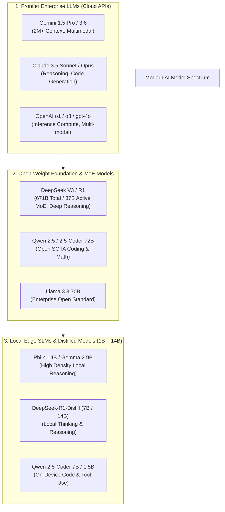
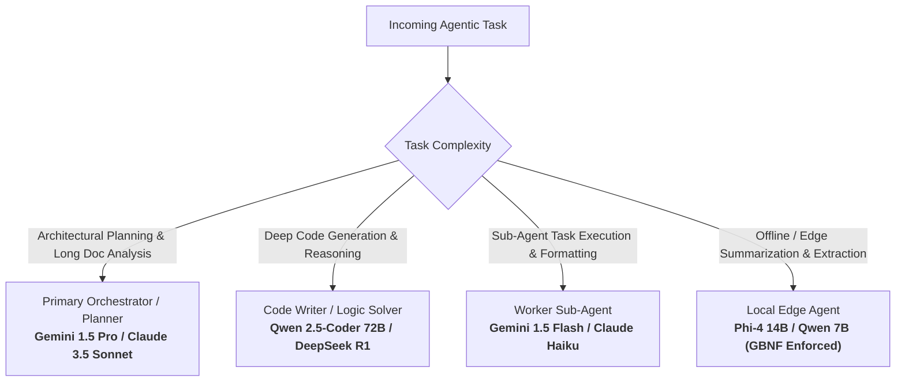

# LLM & SLM Model Landscape, Features & Parameter Comparison Guide (2025–2026)

This document collates all essential technical details, architectural advances, parameter scaling metrics, and feature comparisons across modern **Large Language Models (LLMs)** and **Small Language Models (SLMs)**. It serves as an authoritative reference for selecting, routing, and evaluating models across agentic AI workflows.

---

## 📊 Visual Taxonomy: Modern AI Model Spectrum



---

## 1. Core Technical Dimensions & Architectural Advances

### 1.0 Functional Classifications of Transformer Models
Modern AI models fall into 5 distinct architectural families depending on their attention mask and target task:

| Model Architecture Type | Attention Mechanism | Output Type | Primary Use Case & Examples |
| :--- | :--- | :--- | :--- |
| **Decoder-Only** | Causal (Autoregressive $1\dots N-1$) | Text, Code, `<think>` tokens | Generative AI, Reasoning, Coding (**Gemini 3.6, Llama 3, DeepSeek R1**) |
| **Encoder-Only** | Bi-directional (Full $N \times N$) | Contextual Vector Embeddings | Classification, Search Indexing (**BERT, RoBERTa, DeBERTa**) |
| **Encoder-Decoder (Seq2Seq)** | Bi-directional + Cross-Attention | Sequence Transformation | Translation, Audio Transcription (**T5, BART, Whisper**) |
| **Embedding Models** | Bi-directional + Pooling | Fixed-Dimension Vectors | RAG Semantic Vector Search (**OpenAI `text-embedding-3`, BGE-M3**) |
| **Multimodal (LMMs)** | Cross-Modal Projection | Text + Tool Actions from Visuals | Image/Video/PDF Processing (**Gemini 1.5/3.6, Claude 3.5, GPT-4o**) |

### 1.1 Dense Architecture vs. Mixture-of-Experts (MoE)
- **Dense Models:** Every parameter in the network is active during every token's forward pass.
  - *Example:* Llama 3.3 70B runs all 70 billion parameters for every token.
  - *Trade-off:* High VRAM footprint and compute requirements, but predictable execution time and straightforward quantization.
- **Mixture-of-Experts (MoE):** Utilizes router layers to dynamically direct token representations to a subset of specialized "expert" sub-networks.
  - *Example:* **DeepSeek V3** has 671 billion total parameters, but routes only **37 billion active parameters** per token (2 top-experts + fine-grained shared experts).
  - *Advantage:* Achieves frontier-class quality at a fraction of the per-token inference FLOPs and cost.

### 1.2 Reasoning Models & Inference-Time Compute Scaling
- **Standard Autoregressive Models:** Generate tokens sequentially based directly on prompt context without internal intermediate planning tokens.
- **Reasoning / Thinking Models (e.g., DeepSeek R1, OpenAI o1/o3):** Spend additional FLOPs *during inference* before returning the final response. They generate explicit `<think>...</think>` reasoning chains (chain-of-thought traces) to solve complex logic, math, and code problems.
  - *Key Rule:* Agents invoking reasoning models must parse out or ignore `<think>` tags when extracting structured outputs or executing tool calls.

### 1.3 Context Windows & Retrieval Fidelity (NIAH)
- **Context Capacity:** Ranges from **8K–128K** on edge SLMs up to **1M–2M+ tokens** on frontier LLMs (e.g., Gemini 1.5 Pro).
- **Needle-in-a-Haystack (NIAH) Recall:** Measures whether a model can retrieve specific facts embedded deep within long context windows without suffering from "lost in the middle" degradation.
- **Context Caching (Prefix Caching):** Frontier engines store pre-computed $KV$ attention tensors in memory. Reusing exact static prompt prefixes yields **50% to 90% cost savings** and dramatically reduces Time-To-First-Token (TTFT).

### 1.4 Structured Outputs & Function Calling Protocols
- **Native Tool Calling:** Models trained on specific syntax tokens (e.g., `<tool_call>`) to output valid function names and parameters directly.
- **Grammar-Guided Decoding (GBNF / JSON Schema):** Middleware (vLLM, llama.cpp) masks logits during generation to guarantee 100% adherence to Pydantic/JSON schemas at the API boundary without relying on prompt luck.

### 1.5 Tokenization Mechanics, Vocabulary Size & Token Volume Dynamics

#### 1. Tokenizer Vocabulary Size ($V$) & Character/Sequence Coverage
- **What is Vocabulary Size ($V$)?** The total dictionary size of unique discrete sub-word tokens, words, code syntax constructs, special control tokens, and byte fallbacks recognized by a model's tokenizer.
- **Universal Sequence Coverage via Byte Fallbacks:** Modern tokenizers (BPE with Byte-Fallback / SentencePiece) guarantee 100% coverage of *any* arbitrary text, code, or Unicode character sequence. If an uncommon character or symbol is not in the predefined vocabulary, the tokenizer falls back to encoding raw UTF-8 byte tokens ($0\dots255$).
- **Evolution of Vocabulary Sizes Across Model Families:**
  - **Small Vocabulary Tier (32,000 Tokens — e.g., Llama 2, Mistral 7B):** 
    - *Mechanics:* Relies heavily on breaking text into short 2–3 character sub-words.
    - *Impact:* Code constructs (e.g. 4-space indentation `    `, HTML tags `</div>`, variable names `user_session_id`) and non-English scripts (Hindi, Japanese, Arabic) get fragmented into long token sequences.
  - **Medium-Large Vocabulary Tier (128,000 – 151,643 Tokens — e.g., Llama 3 / 3.3, Qwen 2.5):** 
    - *Mechanics:* Includes common whole words, multi-space code indentations, common code keywords (`import React from`), and multilingual sub-words directly as single unified token IDs.
    - *Impact:* Yields **~15% to 35% higher compression efficiency**. The same 1,000-character code block takes ~250 tokens in Llama 3 compared to ~380 tokens in Llama 2.
  - **Frontier Ultra-Large Vocabulary Tier (200,000 Tokens — e.g., OpenAI `o200k_base` in GPT-4o):**
    - *Mechanics:* Maximizes sub-word consolidation across non-English languages, mathematical formulas, and raw code tokens.
  - **The Embedding & Unembedding Layer Tax:** The factor **2** comes from the two distinct weight matrices operating on the vocabulary:
    1. **Input Embedding Matrix (`tok_embeddings`):** Shape $[V \times H] \implies (V \times H)$ parameters (maps integer token IDs to hidden vectors).
    2. **Output Unembedding Matrix (`lm_head`):** Shape $[H \times V] \implies (H \times V)$ parameters (projects hidden states back into token probability logits).
    - Total Vocabulary Parameters: $(V \times H) + (H \times V) = \mathbf{2 \times (H \times V)}$. *(Note: Models using "Weight Tying" reuse the input matrix for the output layer, reducing the multiplier from 2 to 1).*
  - *Example Calculation (7B Model with Hidden Dimension $H = 4096$):*
    - At $V = 32,000$: $2 \times 4096 \times 32,000 = 262\text{ Million Parameters}$ (~524 MB VRAM footprint in FP16).
    - At $V = 151,643$ (Qwen 2.5): $2 \times 4096 \times 151,643 = 1.24\text{ Billion Parameters}$ (~2.48 GB VRAM footprint in FP16!).
  - **Trade-off Summary:** A larger vocabulary size trades static VRAM model weight memory for dynamic context token efficiency, lower self-attention FLOPs ($O(N^2)$ prefill), and faster generation speed ($O(N)$ output steps).

#### 2. Parameter Accounting: How LLM Weights Add Up to Total Model Size

Every parameter in a modern Decoder-Only Transformer (Llama, Qwen, Mistral) comes from **3 main structural layers**:

| Layer Component | Mathematical Shape | Parameters Formula | 7B Model Example (Llama 2 7B) |
| :--- | :--- | :--- | :--- |
| **1. Vocab Embeddings** | Input $[V \times H]$ + Output $[H \times V]$ | $2 \cdot V \cdot H$ | $2 \times 32,000 \times 4096 = \mathbf{0.26\text{B}}$ |
| **2. Attention Projections** | $L$ layers $\times (W_Q, W_K, W_V, W_O)$ | $\approx L \cdot (4 H^2)$ | $32 \times (4 \times 4096^2) = \mathbf{2.15\text{B}}$ |
| **3. FFN / SwiGLU MLP** | $L$ layers $\times (W_{\text{gate}}, W_{\text{up}}, W_{\text{down}})$ | $L \cdot (3 \cdot H \cdot d_{\text{ffn}}) \approx L \cdot (8 H^2)$ | $32 \times (3 \times 4096 \times 11008) = \mathbf{4.33\text{B}}$ |
| **4. RMSNorm Scales** | $(2L + 1)$ scale vectors | $(2L + 1) \cdot H$ | $(2 \times 32 + 1) \times 4096 = \mathbf{0.0002\text{B}}$ |
| **TOTAL PARAMETERS** | — | $\mathbf{2VH + L(4H^2 + 3H d_{\text{ffn}}) + (2L+1)H}$ | **$\mathbf{6,738,415,616 \approx 6.74\text{ Billion}}$** |

*Note:* In Feed-Forward Networks (SwiGLU), the MLP expansion dimension $d_{\text{ffn}}$ is typically set to $\frac{8}{3} H$. This makes the **FFN component account for ~64% of total model parameters**, while Self-Attention accounts for ~32%, and Vocabulary Embeddings account for 4–15% (depending on $V$).

#### 2. Deep-Dive: How Transformers Process Tokens, FLOPs Math & The $O(N^2)$ Prefill Savings

To understand why a larger vocabulary yields faster inference, we must trace how tokens pass through GPU hardware and Transformer layers step-by-step.

##### A. Step-by-Step Token Processing in a Transformer Layer
When a prompt of sequence length $N$ is fed to a Transformer with hidden dimension $H$ and $L$ layers:

1. **Token ID Lookup (Embedding Layer):** 
   - Integer sequence $[t_1, t_2, \dots, t_N]$ is mapped to an embedding matrix $X \in \mathbb{R}^{N \times H}$. This is a raw memory index lookup ($0$ FLOPs).
2. **Linear Projection to Query ($Q$), Key ($K$), and Value ($V$) Matrices:**
   - $Q = X W_Q, \quad K = X W_K, \quad V = X W_V \quad (W_{Q,K,V} \in \mathbb{R}^{H \times H})$
   - *FLOPs Required per Layer:* $2 \times N \times H^2 \times 3$ (**Scales Linearly $O(N)$** with token count).
3. **Self-Attention Score Calculation ($Q K^T$):**
   - The Query matrix $[N \times H]$ is multiplied by the transposed Key matrix $[H \times N]$ to produce the Attention Score Matrix $[N \times N]$.
   - Every token $i$ computes a dot-product attention score against **every token $j$ from $1 \dots N$**.
   - *FLOPs Required per Layer:* $2 \times N^2 \times H$ (**Scales Quadratically $O(N^2)$** with token count!).
4. **Softmax & Value Accumulation ($\text{Softmax}(Q K^T / \sqrt{d}) V$):**
   - Attention probability matrix $[N \times N]$ is multiplied by Value matrix $[N \times H]$ to produce weighted context representations $[N \times H]$.
   - *FLOPs Required per Layer:* $2 \times N^2 \times H$ (**Scales Quadratically $O(N^2)$**).
5. **Feed-Forward Network (FFN / SwiGLU MLP):**
   - Tokens pass through two non-linear projection layers ($H \to 4H \to H$).
   - *FLOPs Required per Layer:* $2 \times N \times (8 H^2)$ (**Scales Linearly $O(N)$**).

##### B. Why a Shorter Token Sequence ($N$) Drastically Cuts FLOPs
Consider a user prompt containing **5,000 raw characters of source code**:

- **Case 1: Small Vocabulary ($V = 32,000$, e.g. Llama 2)**
  - 5,000 characters tokenize into **$N_1 = 1,500$ tokens**.
  - *Pairwise Attention Operations per Layer:* $N_1^2 = 1,500^2 = \mathbf{2,250,000\text{ attention score pairs}}$.
- **Case 2: Large Vocabulary ($V = 128,000$, e.g. Llama 3 / Qwen 2.5)**
  - The **EXACT SAME 5,000 raw characters** compress into **$N_2 = 1,000$ tokens** (33% token compression).
  - *Pairwise Attention Operations per Layer:* $N_2^2 = 1,000^2 = \mathbf{1,000,000\text{ attention score pairs}}$.

$$\text{Attention FLOPs Reduction} = 1 - \left(\frac{N_2}{N_1}\right)^2 = 1 - \left(\frac{1000}{1500}\right)^2 = 1 - 0.444 = \mathbf{55.5\%\text{ FLOPs Saved!}}$$

> 🚀 **Key Insight:** Even though the underlying human prompt text is identical in length, compressing the sequence length $N$ by **33%** reduces quadratic self-attention FLOPs by **55.5%** during the GPU prefill phase!

##### C. Hardware Execution Dynamics: Prefill (Compute-Bound) vs. Generation (Memory-Bound)
Understanding FLOPs explains how GPU hardware processes prompt ingestion versus token generation:

1. **Prefill Phase (Prompt Ingestion — $N$ tokens processed in parallel):**
   - The GPU Tensor Cores process all $N$ tokens simultaneously in large matrix-matrix multiplications ($GEMM$).
   - **Compute-Bound:** The bottleneck is raw FLOPS throughput (floating-point operations per second). Reducing $N$ directly reduces prefill computation time, drastically improving **Time-To-First-Token (TTFT)**.
2. **Generation Phase (Output Generation — 1 token per step):**
   - The GPU generates one token at a time sequentially. For every new token, the GPU must fetch **all 70+ Billion model weight parameters** from VRAM into GPU SRAM.
   - **Memory-Bandwidth Bound:** The bottleneck is VRAM memory bandwidth (GB/s). A larger vocabulary that produces fewer output tokens requires fewer sequential weight-fetch cycles, directly increasing **tokens per second (t/s)** throughput.

#### 2. Input / Prompt Tokens: Impact of High vs. Low Token Volume
Prompt tokens construct the active self-attention context matrix for the model.

| Metric / Dimension | High Prompt Token Volume (Context Stuffing) | Low Prompt Token Volume (Lean Prompting) |
| :--- | :--- | :--- |
| **Domain Awareness** | **High:** Provides deep context, multi-shot examples, full codebase context, and exhaustive SOPs. | **Focused:** Requires dynamic context retrieval (RAG) to avoid missing critical edge-case data. |
| **Attention Focus** | **Diffused:** Risk of *"Lost in the Middle"* degradation where middle tokens receive lower attention weights. | **Concentrated:** Maximum attention sharpness on core user instructions and system rules. |
| **Prefill Latency (TTFT)** | **High:** $O(N^2)$ quadratic self-attention FLOPs during prefill phase increase Time-To-First-Token. | **Ultra-Fast:** Minimal prefill overhead; instantaneous response startup. |
| **KV Cache Footprint** | **Heavy:** $KV$ cache memory scales linearly with prompt tokens ($N \times \text{layers} \times d_{\text{head}}$), limiting batch concurrency. | **Lightweight:** Small $KV$ cache footprint; maximizes GPU/CPU concurrency. |
| **Cost Trajectory** | **Higher:** Expensive per-turn billing unless exact prefix caching (~90% discount) is maintained. | **Economical:** Lowest cost per API call across all execution turns. |

#### 3. Output / Generation Tokens: Impact of High vs. Low Reasoning Tokens
Output token volume directly dictates generation latency and task accuracy.

- **High Output Token Volume (Reasoning / Chain-of-Thought `<think>` Tokens):**
  - **Pros (Inference-Time Compute Scaling):** Dramatically improves accuracy on non-trivial math, logic, and multi-file coding tasks by giving the model a scratchpad to explore intermediate states, verify assumptions, and self-correct errors.
  - **Cons (Latency & Cost):** Autoregressive generation requires a sequential pass through model weights for *every single output token* ($O(N)$ memory-bandwidth bound). 2,000 reasoning tokens can add several seconds of execution time and double output costs.
- **Low Output Token Volume (Direct / Concise Responses):**
  - **Pros:** Low latency, rapid execution, optimal for tool invocation and structured JSON parsing where reasoning is already pre-computed.
  - **Cons:** Zero scratchpad capacity; higher failure rate and hallucinations on complex multi-step reasoning tasks.

---

## 2. Comprehensive Model Comparison Matrix (2025–2026)

| Model Name | Developer / Provider | Params (Total / Active) | Context Window | Primary Strength & Unique Features | Primary Deployment Mode | License / Access |
| :--- | :--- | :--- | :--- | :--- | :--- | :--- |
| **Gemini 1.5 Pro / 3.6** | Google DeepMind | Proprietary (MoE) | **2,000,000+** | Multimodal, massive context window, long-doc analysis, 90% prompt cache discount | Google Cloud / Vertex AI / Gemini API | Proprietary API |
| **Gemini 1.5 Flash** | Google DeepMind | Proprietary (MoE) | **1,000,000+** | Ultra-low latency, cheap sub-agent execution, dynamic routing target | Google Cloud / Gemini API | Proprietary API |
| **Claude 3.5 Sonnet** | Anthropic | Proprietary | 200,000 | SOTA coding, complex multi-step agentic reasoning, computer use | Anthropic API / AWS Bedrock / GCP Vertex | Proprietary API |
| **Claude 3.5 Haiku** | Anthropic | Proprietary | 200,000 | Fast, cost-effective structured output generation and fast agent routing | Anthropic API | Proprietary API |
| **OpenAI o1 / o3-mini** | OpenAI | Proprietary | 128,000 – 200,000 | Inference-time reasoning, complex STEM / logic benchmarks, high precision | OpenAI API | Proprietary API |
| **GPT-4o** | OpenAI | Proprietary | 128,000 | Omni-multimodal (voice, vision, text), general enterprise standard | OpenAI API | Proprietary API |
| **DeepSeek V3** | DeepSeek | 671B / **37B active** | 128,000 | SOTA MoE efficiency, multi-head latent attention (MLA), low API cost | DeepSeek API / Self-Hosted vLLM | Open Weights (MIT) |
| **DeepSeek R1** | DeepSeek | 671B / **37B active** | 128,000 | Native open-weights reasoning model (`<think>` chains), SOTA math/code reasoning | DeepSeek API / Self-Hosted vLLM | Open Weights (MIT) |
| **Qwen 2.5-Coder 72B** | Alibaba Cloud | 72B (Dense) | 128,000 | Open-weights SOTA code generation, repository-level multi-file editing | Self-Hosted / Cloud Endpoints | Open Weights |
| **Llama 3.3 70B** | Meta | 70B (Dense) | 128,000 | Enterprise open-weight benchmark, high fine-tuning compatibility | Self-Hosted / AWS / Azure | Permissive Llama 3.3 |
| **Phi-4** | Microsoft | 14B (Dense) | 16,000 – 128,000 | High synthetic-data reasoning density in small parameter budget | Self-Hosted / Local Ollama / vLLM | MIT License |
| **DeepSeek-R1-Distill-Qwen-7B** | DeepSeek / Community | 7B (Dense) | 64,000 | Local reasoning model with CoT thinking on consumer GPUs (8GB VRAM) | Local Ollama / llama.cpp | Open Weights |
| **Qwen 2.5-Coder 7B** | Alibaba Cloud | 7B (Dense) | 32,000 – 128,000 | Lightweight on-device coding assistant, fast local autocomplete | Local Ollama / CPU / Edge | Open Weights |
| **Gemma 2 9B / 2B** | Google DeepMind | 9B / 2.6B (Dense) | 8,000 | Ultra-lightweight edge deployment, mobile & integrated GPU compatibility | Local Edge / Embedded | Permissive Open |

---

## 3. Cosmetic & Operational Features Comparison

### 3.1 Cost & Latency Dynamics

```
High Cost / High Latency / Highest Reasoning ───► OpenAI o1 / Gemini Pro / Claude Sonnet
Medium Cost / Balanced Latency               ───► DeepSeek V3 / Qwen 72B / Llama 3.3 70B
Low Cost / High Speed / Sub-Agent Target     ───► Gemini Flash / Claude Haiku
Zero API Cost / On-Prem / Local Edge          ───► Qwen 2.5 7B / Phi-4 / Gemma 2
```

- **Frontier Cloud LLMs:** Best for high-stakes planning, zero-shot complex multi-step reasoning, and long context synthesis.
- **Open-Weight MoE Models:** Offer near-frontier capabilities at **70-80% lower API costs** when self-hosted or accessed via specialized providers.
- **Local Edge SLMs:** Provide **zero API costs**, complete privacy/sovereignty, offline execution, and determinism via grammar-guided decoding.

### 3.2 Feature Matrix: Capabilities by Model Tier

| Feature | Frontier LLMs (e.g. Gemini 3.6, Claude 3.5) | Enterprise MoE (e.g. DeepSeek V3, Qwen 72B) | Edge & Local SLMs (e.g. Phi-4, Qwen 7B) |
| :--- | :--- | :--- | :--- |
| **Context Window** | 1,000,000+ Tokens | 128,000 Tokens | 8,000 – 32,000 Tokens |
| **Prompt Caching** | Native (~90% cost cut) | Provider Dependent | Local KV Cache Reuse |
| **Reasoning Traces (`<think>`)** | Supported (o1/o3) | Native (DeepSeek R1) | Supported via R1 Distills |
| **Function Calling** | Native SDK Integration | High Precision | Requires Schema/GBNF Enforcer |
| **Hardware Required** | Cloud Managed | 4-8x A100/H100 (or API) | Single 8GB GPU or System CPU |
| **Privacy / Sovereignty** | Cloud SLA / Zero-Retention | Full Self-Hosting Control | 100% On-Prem / Offline |

---

## 4. Model Selection Decision Tree for Agentic AI Workflows

When architecting multi-agent systems (as detailed in [multi_agent_architecture_guide.md](file:///home/navin/work/AI/docs/guides/multi_agent_architecture_guide.md) and [model_routing_guide.md](file:///home/navin/work/AI/docs/guides/model_routing_guide.md)), map specific agent roles to appropriate model tiers:



1. **Orchestrator / Supervisor Agent:** Use high-capacity frontier models (**Gemini 1.5 Pro**, **Claude 3.5 Sonnet**) for task decomposition, context window synthesis, and routing.
2. **Specialized Reasoning / Code Worker:** Route heavy algorithmic or multi-file code editing tasks to specialized open-weight models (**DeepSeek R1**, **Qwen 2.5-Coder 72B**).
3. **High-Volume Sub-Agents:** Route repetitive sub-tasks (data transformation, structured output generation, lightweight tool calls) to low-latency fast models (**Gemini 1.5 Flash**, **Claude 3.5 Haiku**).
4. **On-Prem / Edge Privacy Agents:** Use local SLMs (**Phi-4**, **Qwen 2.5-Coder 7B**, **Gemma 2**) coupled with grammar-guided decoding (GBNF) for zero-API-cost processing over sensitive local files.

---

## 📚 Related Workspace Documentation Links

- **[model_routing_guide.md](file:///home/navin/work/AI/docs/guides/model_routing_guide.md)** — Enterprise LLM gateway routing, model consortium, and fallback strategies.
- **[slm_architecture_and_usage_guide.md](file:///home/navin/work/AI/docs/guides/slm_architecture_and_usage_guide.md)** — In-depth guide on Small Language Models (SLMs), VRAM math, and CPU execution dynamics.
- **[multi_agent_architecture_guide.md](file:///home/navin/work/AI/docs/guides/multi_agent_architecture_guide.md)** — Multi-agent topologies, sub-agent process isolation, and context flushing.
- **[structured_outputs_guide.md](file:///home/navin/work/AI/docs/guides/structured_outputs_guide.md)** — Type-safe structured outputs, Pydantic schemas, and GBNF decoding.
- **[scratch_pad.md](file:///home/navin/work/AI/docs/scratch_pad.md)** — Key takeaways on prompt caching, KV cache reuse, and SLM hardware sizing.
