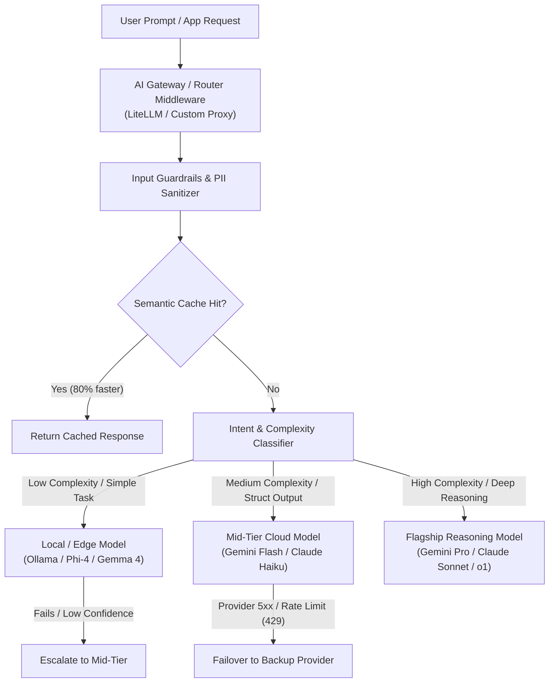
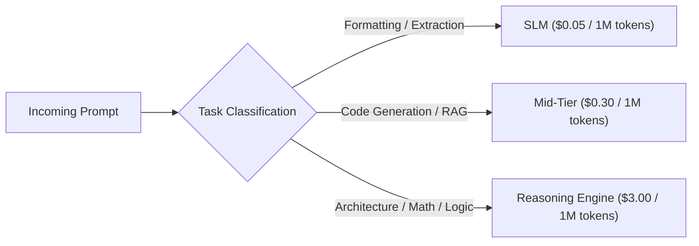
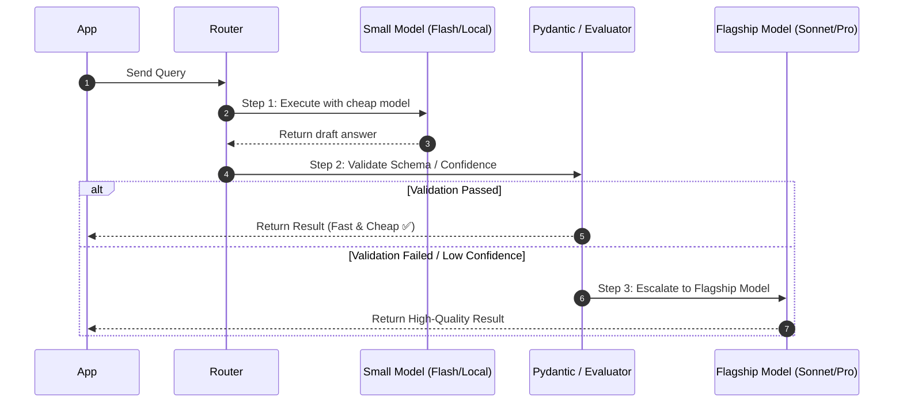

# Enterprise LLM Model Routing: Architecture, Strategies & Best Practices

**Topic:** Designing cost-effective, low-latency, and resilient multi-model LLM architectures using dynamic model routing.

---

## 📊 Visual Architecture & Flowcharts

### 1. Unified Gateway Routing Architecture



---

## 1. Executive Summary & Why Model Routing Matters

In early AI development, applications routed **100% of traffic to a single flagship model** (e.g. GPT-4 or Claude Sonnet). In production, this approach leads to three critical bottlenecks:

1. **Massive Token Waste:** Paying $3.00–$15.00 per million tokens for simple tasks like classification, intent detection, or formatting.
2. **High P99 Latency:** Flagship reasoning models are significantly slower than small specialized models.
3. **Single Point of Failure (SLA Risk):** Rate limits (HTTP 429), provider outages, or degraded latency freeze the entire application.

> 💡 **Model Routing Definition:** A proxy or middleware layer that dynamically inspects incoming prompts, evaluates intent/complexity, and routes the request to the most optimal model based on **cost, speed, capability, and compliance requirements**.

### Production Impact (Industry Benchmarks)
- **40% – 70% reduction in API spend** without degrading overall task accuracy.
- **50% lower average latency** by offloading lightweight sub-tasks to small models (<15B parameters).
- **99.99% uptime** via automated multi-provider failover.

---

## 2. Core Routing Strategies & Patterns

### 2.1 Complexity & Intent-Based Routing

Requests are categorized before model selection:



- **Simple Tasks:** JSON extraction, sentiment analysis, simple summarization, intent classification $\rightarrow$ Route to **Gemma 4 / Phi-4 / Gemini 1.5 Flash / Claude Haiku**.
- **Complex Tasks:** Multi-file coding, complex architectural reasoning, legal compliance analysis $\rightarrow$ Route to **Claude Sonnet / Gemini Pro / DeepSeek-R1**.

---

### 2.2 Cascading & Escalation Routing

Send the query to a fast, cheap model first. If the output fails a confidence or validation check, automatically escalate to a stronger model.



---

### 2.3 Local-First & Hybrid Cloud Fallback

Prioritize running inference on local hardware or private VPC endpoints (via Ollama or vLLM) for privacy and zero marginal cost, falling back to cloud APIs when necessary.

- **Local Execution:** Use local models for sensitive PII data, internal documentation parsing, and scratchpad agent loops.
- **Cloud Fallback:** Automatically route to cloud providers if:
  1. The local GPU node is at 100% capacity or queue time exceeds threshold.
  2. The prompt requires capabilities exceeding local model capacity (e.g. 1M token context window).

---

### 2.4 The LLM-as-a-Judge Optimization Pattern

Using LLMs to evaluate other LLM outputs (evals, guardrails, quality grading) can become extremely expensive if using flagship models.

**The Routing Strategy for Evals:**
1. **Never use flagship models for initial grading.** Use a fast mid-tier or local model (e.g., Gemini Flash or Llama 3 8B) trained with explicit rubrics and `Pydantic` output constraints.
2. **Batch Evaluation:** Run evaluation tasks asynchronously in background queues using provider Batch APIs (50% discount).
3. **Escalation on Disagreement:** Only invoke a flagship model if two small judges disagree on a score.

---

### 2.5 Prompt Caching & Cache-Affinity Routing

Prompt caching allows LLM providers and inference engines (vLLM RadixAttention, SGLang) to reuse pre-computed Key-Value ($KV$) attention states across requests.

#### How It Works Under the Hood
1. **Causal Attention Constraint:** Autoregressive models compute attention where token $N$ attends to tokens $1 \dots N-1$. The $KV$ tensors for token $N$ depend strictly on the exact token sequence preceding it.
2. **Exact Prefix Match:** If the prompt prefix matches a previously cached request starting from token `0`, the provider reuses the KV cache in GPU memory, bypassing matrix multiplication FLOPs.
3. **Discount Economics:** Providers pass compute FLOPs savings to users via **50% to 90% input token cost discounts** and significantly lower time-to-first-token (TTFT) latency.

#### Cache-Aware Routing Rules
- **Static Prefix Ordering:** Always position static prompt components (system instructions, SOPs, tool definitions, schemas) at the top of the prompt payload. Put dynamic elements (user queries, changing timestamps) at the end.
- **Provider / Model Cache Affinity:** When routing agent workflows, stick to the same provider/model family for multi-turn sessions. Switching providers mid-session invalidates the provider-side KV cache.

---

## 3. Implementation Approaches & Code Examples

### Approach A: Custom Router in Python (Embedding-Based / Heuristic)

Using semantic embeddings or lightweight heuristic classifiers to inspect the prompt before calling an LLM API.

```python
from enum import Enum
from pydantic import BaseModel
import instructor
from openai import OpenAI
from anthropic import Anthropic

class TaskComplexity(str, Enum):
    SIMPLE = "simple"       # Classification, formatting, simple QA
    MEDIUM = "medium"       # Standard code generation, summarization
    COMPLEX = "complex"     # Architecture, deep math, multi-step logic

class ComplexityClassifier(BaseModel):
    complexity: TaskComplexity
    reason: str

# Fast, cheap classifier using Gemini Flash or OpenAI Mini
def classify_prompt(prompt: str) -> TaskComplexity:
    client = instructor.from_openai(OpenAI())
    res = client.chat.completions.create(
        model="gpt-4o-mini",
        response_model=ComplexityClassifier,
        messages=[
            {"role": "system", "content": "Classify the reasoning complexity required for the user prompt."},
            {"role": "user", "content": prompt}
        ]
    )
    return res.complexity

# Router dispatcher
def route_and_execute(prompt: str) -> str:
    complexity = classify_prompt(prompt)
    
    if complexity == TaskComplexity.SIMPLE:
        print("Routing to local/fast model (Ollama / Gemini Flash)...")
        # Execute via local Ollama or cheap endpoint
        client = OpenAI(base_url="http://localhost:11434/v1", api_key="ollama")
        return client.chat.completions.create(model="gemma2:9b", messages=[{"role": "user", "content": prompt}]).choices[0].message.content

    elif complexity == TaskComplexity.MEDIUM:
        print("Routing to Mid-Tier (Claude Haiku / Gemini Flash)...")
        client = Anthropic()
        return client.messages.create(model="claude-3-5-haiku-20241022", max_tokens=1024, messages=[{"role": "user", "content": prompt}]).content[0].text

    else:
        print("Routing to Flagship Model (Claude Sonnet)...")
        client = Anthropic()
        return client.messages.create(model="claude-3-5-sonnet-20241022", max_tokens=4096, messages=[{"role": "user", "content": prompt}]).content[0].text
```

---

### Approach B: Open-Source Gateway — LiteLLM Proxy

**LiteLLM** acts as an OpenAI-compatible proxy server that runs in your infrastructure, handling load balancing, model aliases, cost tracking, and automatic failover.

#### `config.yaml` for LiteLLM Proxy:

```yaml
model_list:
  # Model Alias for "fast-cheap" tasks
  - model_name: cheap-model
    litellm_params:
      model: gemini/gemini-1.5-flash
      api_key: os.environ/GEMINI_API_KEY
    
  # Backup for cheap-model if Gemini is down
  - model_name: cheap-model
    litellm_params:
      model: anthropic/claude-3-5-haiku-20241022
      api_key: os.environ/ANTHROPIC_API_KEY

  # Model Alias for "reasoning-heavy" tasks
  - model_name: flagship-model
    litellm_params:
      model: anthropic/claude-3-5-sonnet-20241022
      api_key: os.environ/ANTHROPIC_API_KEY

router_settings:
  routing_strategy: usage-based-routing-v2  # Load balance across API keys
  num_retries: 3
  fallbacks:
    - cheap-model: ["anthropic/claude-3-5-haiku-20241022"]
    - flagship-model: ["gemini/gemini-1.5-pro"]
```

#### Calling LiteLLM from Application Code:

```python
from openai import OpenAI

# Point your application client to the local LiteLLM Proxy
client = OpenAI(base_url="http://localhost:4000", api_key="sk-anything")

# Automatically routes, load-balances, and fails over based on proxy config
response = client.chat.completions.create(
    model="cheap-model",  # Uses model alias defined in config.yaml
    messages=[{"role": "user", "content": "Summarize this paragraph."}]
)
```

---

## 4. Tool & Framework Landscape (2026 Comparison)

| Router Tool | Type | Best For | Standout Feature |
|---|---|---|---|
| **LiteLLM** | Self-Hosted Gateway | Full infrastructure control, self-hosted VPC | OpenAI-compatible proxy, broad provider support, fine-grained RBAC & budget tracking |
| **OpenRouter** | Managed SaaS Proxy | Zero-ops instant multi-model access | 300+ models, unified billing, automatic provider fallback |
| **NotDiamond** | Learned Router (SaaS) | Dynamic quality-vs-cost optimization | Uses ML models to predict which LLM will score highest for a given prompt |
| **RouteLLM** | Open-Source Framework | Research-backed cost routing | Algorithmic routing between cheap and strong models using preference data |
| **Semantic Router** | Python Library | Super-fast intent routing | Uses vector embeddings to route prompts before making any LLM call |
| **Portkey / Bifrost** | Enterprise AI Gateway | Enterprise governance & security | Built-in PII redaction, guardrail enforcement, advanced telemetry |

---

## 5. Enterprise Best Practices & Production Checklist

### ✅ 1. Combine Routing with Semantic & Prompt Caching
- **Semantic Caching:** Store responses for semantically similar prompts in a vector DB (Redis / Qdrant). Reduces latency to <50ms and saves 100% of tokens for cached queries.
- **Prompt Caching:** Place large static context (system prompts, guidelines, SOPs) at the top of the prompt payload to get 85%+ discounts on input tokens.

### ✅ 2. Implement Session & Model Affinity
- Once a multi-turn conversation starts, **pin the session to the same model family** if possible.
- Switching models mid-conversation breaks prompt cache hits and may cause subtle behavioral shifts.

### ✅ 3. Monitor "Cost Per Successful Task" Not Just "Cost Per Request"
- A cheap model that fails 3 times and requires retries can end up costing more than calling a flagship model once.
- Track metrics: **First-pass resolution rate**, **Escalation rate**, and **Total cost per completed task**.

### ✅ 4. Set Hard Circuit Breakers & Budget Caps
- Configure budget caps at the router gateway level (e.g. max $50/day per service/team).
- Implement automated circuit breakers to halt agent loops if an infinite loop occurs.

---

## 6. Summary: Strategic Decision Matrix

| Requirement | Recommended Strategy | Recommended Tool |
|---|---|---|
| **Data Sovereignty & On-Premise** | Local-first hybrid routing with cloud failover | LiteLLM Proxy + Ollama/vLLM |
| **Maximum Cost Savings** | Intent classification + Cascading escalation | Semantic Router + LiteLLM |
| **Zero Infrastructure Management** | Unified API key with multi-provider fallback | OpenRouter |
| **LLM-as-a-Judge / Evals Pipeline** | Small model with Pydantic + Batch API + Flagship disagreement escalation | `instructor` + Gemini Flash / Claude Haiku |

---

## 7. Model Configuration: LiteLLM vs. Simple App Config

Even if you do not perform dynamic routing and simply want to configure 1 or 2 models (e.g., Gemini Flash + Claude Sonnet), here is how to decide between LiteLLM and a simple application config:

### Option 1: LiteLLM Python SDK (`litellm.completion`)
If you want to support multiple providers without running a separate proxy server or Docker container, use the **LiteLLM Python SDK**:

```python
from litellm import completion

# Single unified syntax for 100+ providers
response_gemini = completion(
    model="gemini/gemini-1.5-flash",
    messages=[{"role": "user", "content": "Hello!"}]
)

response_claude = completion(
    model="claude-3-5-sonnet-20241022",
    messages=[{"role": "user", "content": "Hello!"}]
)
```
- **Pros:** Unified OpenAI-style parameter format across all providers. Extremely easy to switch models via `.env` or simple YAML configs.
- **Cons:** Adds `litellm` as a third-party dependency.

---

### Option 2: Simple Application-Level Abstraction (`BaseLLMClient`)
If you only use 1 or 2 models and want **zero external proxy/middleware dependencies**, a simple factory pattern in your codebase is usually best:

```python
# Simple config in python or YAML
CONFIG = {
    "primary_model": "claude-3-5-sonnet-20241022",
    "cheap_model": "gemini-1.5-flash"
}

def get_llm_client(model_name: str):
    if "claude" in model_name:
        return AnthropicClient(model=model_name)
    elif "gemini" in model_name:
        return GeminiClient(model=model_name)
    raise ValueError(f"Unknown model: {model_name}")
```
- **Pros:** Zero extra dependencies, 100% transparent, easy to debug.
- **Cons:** You maintain the wrapper code if provider APIs change.

---

### Option 3: LiteLLM Proxy Server
- **When to use:** Only when you have multiple microservices, background jobs, or teams needing centralized budget caps, API key management, and shared fallback rules.

---

## 🔍 Section 8: Keywords & Concepts for Deep-Dive Study

Curated index of advanced model routing and gateway concepts for future study:

1. **Universal Provider Abstraction:** How translation proxies convert OpenAI schema payloads to Anthropic or Gemini REST payloads on the fly.
2. **Model Aliases:** Abstracting provider-specific model strings (`claude-3-5-sonnet-20241022`) behind semantic operational aliases (`fast-cheap`, `primary-reasoning`).
3. **Logit Bias & Parameter Divergence:** Understanding how temperature, top_p, and logit bias parameters behave differently across providers.
4. **Cascading Escalation & Confidence Thresholds:** Quantitative criteria for triggering automatic fallbacks based on logprob scores or Pydantic validation errors.
5. **Semantic Caching & Cosine Similarity:** Vector cache lookup algorithms that intercept queries before hitting LLM APIs.
6. **Prompt Caching & KV Cache Reuse:** Prefix tree (RadixAttention) matching algorithms to reuse pre-calculated key-value attention tensors across requests.
7. **Circuit Breakers & Exponential Backoff:** Gateway fault-tolerance patterns for rate limits (HTTP 429) and provider 5xx errors.
8. **Speculative Decoding & Speculative Routing:** Draft-and-verify multi-model execution loops for ultra-low latency generation.
9. **Pareto Frontier in Model Selection:** Evaluating model performance curves (MMLU / HumanEval score vs. token cost) to pick optimal routing thresholds.

---

## References & Further Reading

- [LiteLLM Proxy Documentation](https://docs.litellm.ai/)
- [NotDiamond AI Routing Paper & Docs](https://www.notdiamond.ai/)
- [RouteLLM GitHub Repository](https://github.com/lm-sys/RouteLLM)
- [Semantic Router Library](https://github.com/aurelio-labs/semantic-router)
- [OpenRouter Model Directory](https://openrouter.ai/)
