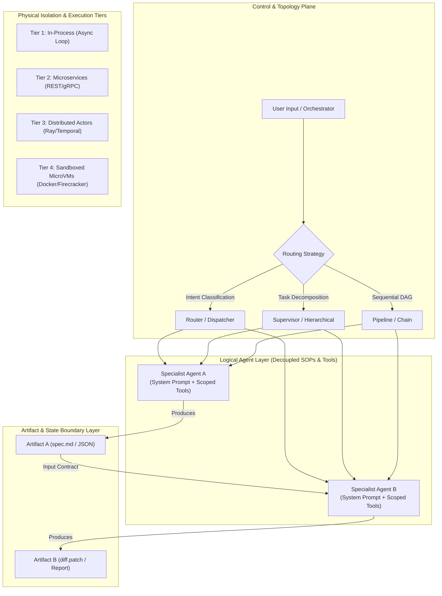

# Multi-Agent Architectural Patterns, Process Isolation & Best Practices: A Technical Guide

**Topic:** Comprehensive reference guide on multi-agent architectural topologies, the equivalence of Agent vs. SOP selection, physical process boundaries, artifact-based state isolation, and production guardrails.

---

## 📊 Visual Blueprint: Multi-Agent Design Spectrum



---

## 1. Conceptual Equivalence: Agent Selection vs. SOP Selection

A fundamental insight in agentic engineering is that **selecting an Agent is conceptually equivalent to selecting a Declarative Standard Operating Procedure (SOP) bound to a specific execution context**.

> **Formula:** $\text{Agent} = \text{Declarative SOP} + \text{Scoped Tools} + \text{Permissions} + \text{Dedicated Memory Scope}$

### The Architectural Continuum

```
[ Tier A: Monolithic Agent ] ──► [ Tier B: Single Agent + Dynamic SOP Injection ] ──► [ Tier C: Multi-Agent System ]
     (Single prompt)                  (Dynamic SOP loading into one context)             (Isolated runtimes & tools)
```

| Dimension | Single Agent + Dynamic SOP Injection | Multi-Agent Architecture |
| :--- | :--- | :--- |
| **Selection Unit** | Dynamically loaded Markdown guideline injected into system prompt. | Dedicated LLM instance + specific system prompt + strictly scoped tools. |
| **Context Window** | Shared context window; history accumulates in a single transcript. | Isolated context window per agent; clean memory boundaries. |
| **Tool Footprint** | All tools attached to single agent (high schema bloat). | Tools distributed across specialists (low schema overhead). |
| **Compute Model** | Homogeneous LLM across all steps. | Heterogeneous LLMs (e.g., SLMs for routing, frontier models for coding). |
| **Failure Radius** | High: A loop failure or hallucination pollutes the entire session history. | Low: Isolated to sub-agent; supervisor retries sub-task without full context rot. |

### The Tipping Point: When SOP Selection Evolves into Agent Selection

You should transition from injecting an SOP into a single agent to spawning a distinct agent when:
1. **Security & Tool Permissions**: SOP $A$ requires write/bash permissions, while SOP $B$ requires read-only search access.
2. **Tool Schema Bloat**: The total number of tools exceeds 10–15, leading to tool-selection confusion and higher token overhead.
3. **Context Window Rot**: The task requires processing noisy logs or web scrapes that would pollute the active context window for downstream reasoning.
4. **Heterogeneous Compute**: Routing a sub-task to a smaller, faster model (e.g., 8B SLM) to reduce costs.
5. **Parallel Execution**: Sub-tasks can be executed concurrently in isolated execution sub-loops.

---

## 2. The "New Chat Thread" Analogy for Context Window Hygiene

Passing work between agents in a multi-agent workflow is directly analogous to **starting a new chat thread** when switching topics in an AI workspace:

```
HUMAN CHAT THREAD WORKFLOW:
[ Chat Thread 1: SQL Optimization ] ──► (Topic Switch) ──► [ New Chat Thread 2: React Component Design ]
  - SQL query logs cleared                                   - Fresh context window
  - Zero context pollution                                   - High attention & speed

MULTI-AGENT WORKFLOW:
[ Agent A: SQL Agent ]              ──► (Handoff Artifact) ──► [ Agent B: UI Component Agent ]
  - Raw SQL logs remain in Agent A                           - Receives only final DB schema spec
  - Sub-agent context window flushed                         - Zero token bloat
```

### Benefits of Context Flushing via Sub-Agents
* **Eliminates "Lost in the Middle" Degradation**: Prevents attention decay caused by long, noisy histories.
* **Maximizes KV Cache Hits**: Clean, standardized system prompts at the top of each sub-agent payload hit the serving engine's KV cache.
* **Reduces Token Costs**: Up to 80% cost reduction by passing concise final artifacts rather than full raw conversation trajectories.

---

## 3. Multi-Agent Topologies

| Topology | Pattern Description | Best Used For |
| :--- | :--- | :--- |
| **Supervisor / Hierarchical** | Central Manager LLM decomposes goals, delegates sub-tasks to specialist agents, and aggregates results. | Complex, non-deterministic tasks requiring dynamic task planning. |
| **Router / Dispatcher** | Lightweight classifier routes incoming query to exactly one specialist agent. | Customer support triage, multi-modal intake systems. |
| **Sequential Pipeline** | Deterministic DAG where output artifact of Agent $N$ becomes input to Agent $N+1$. | Standardized data extraction, translation, and validation pipelines. |
| **Generator-Evaluator Loop** | Generator Agent creates output; Evaluator Agent validates against rubric and provides feedback loop. | Code generation, security policy compliance, high-accuracy writing. |
| **Shared Workspace (Blackboard)** | Specialists asynchronously read from and write to a centralized state object. | Distributed incident response, multi-perspective security analysis. |

---

## 4. Physical Process Isolation Tiers

Agents are logical abstractions, but physically they run across four distinct deployment tiers:

```
[ Tier 1: In-Process ] ────► [ Tier 2: Microservices ] ────► [ Tier 3: Distributed Actors ] ────► [ Tier 4: Sandboxed MicroVMs ]
(Lightweight Python/TS)      (Containers / Pods)              (Ray / Temporal / Celery)          (Docker / Firecracker)
 Lowest Latency               Moderate IPC Overhead             High Scale & Fault Tolerance        Highest Security Isolation
```

### Detailed Isolation Tier Comparison

| Dimension | Tier 1: In-Process | Tier 2: Microservices | Tier 3: Distributed Actors | Tier 4: Sandboxed MicroVMs |
| :--- | :--- | :--- | :--- | :--- |
| **Process Boundary** | Shared OS Process | Separate Processes/Pods | Distributed Worker Nodes | Hardware Virtualization |
| **Communication** | In-Memory / Async Queues | HTTP / gRPC / WebSockets | Event Log / Mailbox | gRPC / Stdin Pipe |
| **Handoff Latency** | $< 1\text{ ms}$ | $5 - 50\text{ ms}$ | $10 - 100\text{ ms}$ | $50 - 500\text{ ms}$ |
| **Security Isolation** | Low (Shared RAM) | Medium (Container) | Medium (Worker Node) | High (Hypervisor Sandbox) |
| **Fault Isolation** | Low (Process crash) | High (Pod isolation) | High (Auto-recovery) | High (Complete containment) |

---

## 5. Artifact Ownership & Modular State Isolation

To prevent state contamination across agents, enforce **Artifact-Driven Handoffs**:

1. **Artifact Ownership**: Each agent owns specific input and output files (e.g., `spec.md`, `feature.patch`, `test_report.json`).
2. **Explicit Contracts**: Agents interact through structured file boundaries or Pydantic JSON payloads, never through raw unstructured conversational text.
3. **Scratchpad Segregation**: Intermediate trial-and-error logs, shell output, and temporary data files are written to scratch directories (e.g., `scratch/`) and excluded from downstream agent contexts.

---

## 6. Production Best Practices & Guardrails

Adhere strictly to the workspace agent design rules:

1. **ReAct Loop Safety (`max_loops`)**: Always implement a hard threshold (10–15 iterations) per agent to prevent expensive hallucination loops.
2. **Schema-Enforced Boundaries**: Enforce typed output schemas (Pydantic / JSON Schema) at every agent handoff boundary.
3. **Prefix Caching Alignment**: Place static system instructions and guidelines at the very top of each agent prompt to maximize KV cache hit rates.
4. **Structured Telemetry**: Maintain dual transcripts—a lightweight `transcript.jsonl` for fast debugging and `transcript_full.jsonl` for deep trajectory auditing.
5. **Heterogeneous Model Assignment**: Pair heavy reasoning tasks with frontier models and lightweight routing/triage with fast Sub-10B Small Language Models (SLMs).
