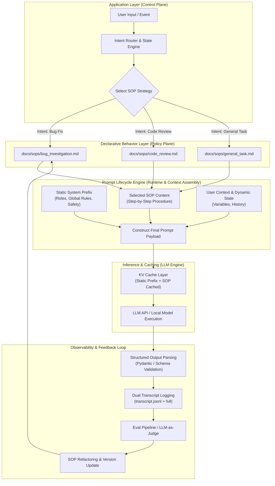

# Prompt Engineering, Declarative SOPs & Prompt Lifecycle Management: A Study Guide

**Topic:** Complete architectural reference for Prompt Architecture, Declarative Standard Operating Procedures (SOPs), Prompt Lifecycle Management (PLM), and unexplored frontier research areas in LLM context engineering.

---

## 📊 Visual Summary & Architectural Blueprint



---

## 1. Domain Alignment & Taxonomy

Prompt Engineering, Declarative Standard Operating Procedures (SOPs), and Prompt Templates are not disparate tools; they represent progressive tiers of **Context Engineering** and **LLM Behavioral Architecture**.

```
[ Tier 1: Raw Prompt Engineering ]  --> Single inline system/user string literals inside application code.
                 │
                 ▼
[ Tier 2: Parameterized Templates ] --> String formatting with dynamic runtime slot filling ({user_query}, {docs}).
                 │
                 ▼
[ Tier 3: Declarative SOPs ]        --> Modular, version-controlled Markdown/YAML files defining step-by-step procedures.
                 │
                 ▼
[ Tier 4: Dynamic Lifecycle Engine ]--> Intent routing, KV-cache aligned prefixing, automated evals, and observability.
```

### Key Concept Taxonomy

1. **Prompt Engineering:** The baseline discipline of crafting roles, task instructions, zero/few-shot examples, and structural constraints to direct LLM probabilistic output generation.
2. **Declarative SOPs (Standard Operating Procedures):** High-level task specifications stored as structured text/markdown outside runtime code. An SOP specifies *what* steps, guidelines, rules, and constraints an agent must follow for a specific intent, delegating *how to execute tools and maintain state* to the application runtime.
3. **Dynamic Context Injection:** The runtime mechanism that classifies user intent and injects only the necessary SOPs and contextual dependencies into the active prompt window.
4. **Prompt Lifecycle Management (PLM):** The operational framework (LLMOps/PromptOps) encompassing authoring, version control, dynamic hydration, evaluation, shadow deployment, tracing, and deprecation of prompt assets.

---

## 2. Baseline Prompt Engineering vs. Declarative SOP Architecture

| Dimension | Baseline Prompt Engineering | Declarative SOP Architecture |
| :--- | :--- | :--- |
| **Location** | Hardcoded string literals inside runtime codebase (Python, TypeScript, Go). | Externalized, versioned Markdown (`.md`) or YAML (`.yaml`) files in policy directories (e.g. `docs/sops/`). |
| **Coupling** | High coupling between model guidance, API calls, and business logic. | Strict decoupling: Application handles control flow; SOP handles behavioral policies. |
| **Token Efficiency** | Monolithic prompts containing instructions for *all* edge cases (~10k+ tokens). | Dynamic injection: Router loads only the targeted SOP (~500–1,500 tokens). |
| **KV Caching Impact** | Poor if dynamic user state is mixed into top-level system instructions. | High: Static system prefix and SOP prefix stay unchanged across turns. |
| **Maintainability** | Requires software engineers to submit code PRs and redeploy services. | Domain experts can update workflow SOPs independently of application code releases. |
| **Validation** | Ad-hoc regex parsing or plain text outputs. | Typed output boundaries (Pydantic / JSON Schema) enforcing structural guarantees. |

---

## 3. Comprehensive Framework for Prompt Lifecycle Management (PLM)

Managing prompts in enterprise and multi-agent production systems requires treating prompts with the same software engineering rigor as source code.


### Stage 1: Design, Layout & Caching Alignment
- **Prefix Isolation for KV Cache:** Position large, invariant content (system role, foundational guardrails, rigid persona) at the very top of the prompt payload. Keep this prefix static across all turns to maximize GPU KV-cache re-use (slashing inference latency and cost).
- **Decouple Structure from Text:** Use native JSON Schema or Pydantic validation for structured outputs rather than embedding fragile formatting rules inside the prompt text.
- **Modular SOP Decomposition:** Break complex monolithic prompts into discrete, task-focused SOPs (e.g., [bug_investigation.md](file:///home/navin/work/AI/docs/sops/bug_investigation.md), [code_review.md](file:///home/navin/work/AI/docs/sops/code_review.md), [general_task.md](file:///home/navin/work/AI/docs/sops/general_task.md)).

### Stage 2: Versioning & Storage ("Prompts as Code")
- **Git & Registry Storage:** Treat SOP files and prompt templates as code artifacts stored in Git or dedicated Prompt Registries (e.g., Langfuse Prompt Hub, MLflow Prompt Registry).
- **Semantic Versioning & Immutable Hashes:** Reference prompts via explicit tags (e.g., `sop_bug_fix@v1.4.2` or Git commit SHA `a7f93e2`). Avoid using unversioned floating tags like `latest` in production.
- **Metadata Management:** Track prompt metadata including target foundation model, temperature, top_p, max_tokens, and author notes alongside the prompt template.

### Stage 3: Dynamic Composition & Hydration
- **Intent-Based SOP Routing:** Use lightweight intent classification (semantic router, zero-shot classifier, or vector search) to fetch and append *only* the matching SOP file.
- **Token Tax & Guardrail Scaling:** Scale instructions based on model size/capability. Frontier models require fewer explicit negative constraints, whereas smaller local models benefit from explicit negative guardrails.

#### Dynamic SOP Injection Code Example

```python
from pathlib import Path

SOP_DIR = Path("docs/sops/")

# 1. Static System Prefix (Invariant across turns -> KV Cache Hit)
STATIC_SYSTEM_PREFIX = """You are an AI Engineering Assistant.
Follow safety boundaries and return high-quality analysis."""

def get_sop_by_intent(user_query: str) -> str:
    """Intent Router: Map query to declarative SOP file."""
    if "bug" in user_query.lower() or "error" in user_query.lower():
        sop_file = SOP_DIR / "bug_investigation.md"
    elif "review" in user_query.lower():
        sop_file = SOP_DIR / "code_review.md"
    else:
        sop_file = SOP_DIR / "general_task.md"
    
    return sop_file.read_text(encoding="utf-8")

def assemble_dynamic_prompt(user_query: str) -> list[dict]:
    # 2. Dynamically fetch matching SOP
    active_sop = get_sop_by_intent(user_query)

    # 3. Dynamic Hydration: Combine Static Prefix + Injected SOP
    system_prompt = f"{STATIC_SYSTEM_PREFIX}\n\n### ACTIVE SOP PROCEDURES\n{active_sop}"

    # 4. Construct API payload
    return [
        {"role": "system", "content": system_prompt},
        {"role": "user", "content": user_query}
    ]
```

### Stage 4: Testing & Evaluation (Prompt Evals)
- **Gold-Standard Evaluation Datasets:** Maintain benchmark datasets containing diverse inputs, edge cases, and expected ground-truth outcomes.
- **Multi-Layered Assertion Pipeline:**
  1. *Structural Pass:* JSON Schema validation (Pydantic).
  2. *Deterministic Pass:* Exact matches, regex constraints, forbidden key check.
  3. *Semantic Pass:* LLM-as-a-Judge rubrics evaluating helpfulness, safety, conciseness, and SOP compliance.
- **CI/CD Integration:** Automatically run prompt eval regression tests on PRs modifying prompt files or SOP markdown documents before merging.

### Stage 5: Deployment & Release Strategies
- **Shadow Executions:** Execute new candidate prompts (`v2`) in parallel (asynchronously) alongside live production prompts (`v1`) to evaluate accuracy and latency without user impact.
- **Canary & A/B Routing:** Route a configurable fraction of live traffic (e.g., 5%) to new prompt/SOP versions using remote configuration flags.
- **Instant Rollbacks:** Decouple prompt updates from app deployments so regressions can be remediated instantly by switching feature flags.

### Stage 6: Telemetry, Observability & Feedback
- **Structured Tracing:** Log full prompt payloads, filled template variables, model parameters, output tokens, cost, and latency using OpenTelemetry or dedicated LLM tracing tools.
- **Dual-Transcript Strategy:**
  - `transcript.jsonl`: Truncated parameter logs for fast, lightweight daily debugging and trajectory search.
  - `transcript_full.jsonl`: Untruncated raw payloads for deep trajectory analysis and offline model fine-tuning.
- **Feedback Association:** Attach user interaction signals (thumbs up/down, copy action, edit distance, task completion status) directly to prompt version hashes.

### Stage 7: Refactoring, Pruning & Deprecation
- **SOP Pruning:** Regularly audit active SOPs to remove obsolete guidelines, conflicting instructions, and token bloat.
- **Model Migration Adapters:** Adapt prompts when upgrading foundation models (e.g., replacing model-specific XML tags with markdown blocks or explicit system roles).
- **Deprecation Lifecycles:** Sunset legacy prompt versions gracefully after grace periods, logging warnings whenever an outdated prompt tag is invoked.

---

## 4. Unexplored Subtopics & Frontier Research in Prompt Engineering & SOPs

While basic prompt engineering and static SOP management are established, several high-impact areas remain open for active exploration and research:

```mermaid
mindmap
  root((Frontier SOP & PLM Research))
    Self-Evolving SOPs
      DSPy-Style Auto-Optimization
      Failure-Driven SOP Patching
      Reinforcement Learning from Agent Trajectories
    Formal Verification
      Compiling SOPs to FSMs
      Linear Temporal Logic (LTL) Bounds
      Deterministic Guardrail Enforcement
    Multi-Agent SOP Composition
      Hierarchical SOP Inheritance
      Cross-Agent Conflict Resolution
      Context Isolation & Subagent Scoping
    Cross-Model Transpilation
      Model-Agnostic SOP Intermediate Representation (IR)
      Format Translators (XML ↔ Markdown ↔ JSON)
      Capability-Aware Guardrail Injection
    Differential Testing & Semantic Drift
      Prompt Diff Impact Analysis
      A/B Trajectory Mutation Testing
      Automated Regression Localizers
    Automated KV-Cache Layout Optimization
      Global Token Alignment Algorithms
      Prefix Ordering Engine
      Dynamic Batching Cache Profilers
```

### 4.1 Self-Evolving & Meta-Optimized SOPs
- **Concept:** Moving from manual human-edited SOPs to automated, self-improving SOPs.
- **Research Question:** How can an agent automatically analyze its own execution failure trajectories (`transcript_full.jsonl`) and use a meta-prompting optimizer (similar to DSPy or Text-Grad) to propose targeted patches to its own `.md` SOP files?
- **Key Challenge:** Preventing "overfitting" to a single failure case while preserving global behavioral safety and human readability.

### 4.2 Formal Verification & SOP-to-FSM Compilation
- **Concept:** Converting natural language declarative SOPs into mathematically verifiable state machines.
- **Research Question:** Can declarative SOP steps be compiled into Finite State Machines (FSMs) or Linear Temporal Logic (LTL) formulas that govern tool access at runtime, guaranteeing the model *cannot* take illegal transitions regardless of prompt injection or hallucination?
- **Key Challenge:** Bridging the gap between natural language flexibility and rigid mathematical state verification.

### 4.3 Multi-Agent SOP Composition & Inheritance
- **Concept:** Designing object-oriented or trait-based inheritance for SOPs across multi-agent hierarchies.
- **Research Question:** When a lead agent delegates a task to a specialized subagent, how should the subagent inherit parent SOP safety constraints while overriding domain-specific execution steps without context window bloat?
- **Key Challenge:** Preventing conflicting instructions when composing multiple SOP modules into a single execution turn.

### 4.4 Cross-Model SOP Transpilation & Intermediate Representation (IR)
- **Concept:** Writing SOPs in a model-agnostic Intermediate Representation (IR) that compiles down to model-specific optimal formats.
- **Research Question:** Different models have distinct prompt sensitivities (e.g., Anthropic models respond best to structural `<xml>` tags, OpenAI models to markdown headings, and local models to explicit system/user framing). Can we create an SOP Compiler that translates a single source SOP into model-optimized prompts?
- **Key Challenge:** Maintaining semantic equivalency across heterogeneous model architectures.

### 4.5 Differential Prompt Testing & Semantic Drift Analysis
- **Concept:** Analyzing the cascading behavioral impact of changing a single line or rule in a 1,000-line SOP dataset.
- **Research Question:** How do we measure "semantic diffs" and spot subtle unintended side-effects across non-deterministic outputs when modifying an SOP guideline?
- **Key Challenge:** Traditional string diffs fail to capture changes in model reasoning trajectories; requires behavioral trajectory diffing.

### 4.6 Automated KV-Cache Layout Optimization
- **Concept:** Runtime compilers that dynamically rearrange injected SOP modules, system prefixes, and context variables to maximize GPU KV-cache hit rates across batch requests.
- **Research Question:** Given N concurrent user sessions running different SOP workflows, what is the optimal sequence of prompt assembly that maximizes shared prefix length across model server batches (vLLM/SGLang)?
- **Key Challenge:** Balancing optimal KV-cache prefix sharing against optimal prompt structure for model reasoning quality.

### 4.7 Adversarial Robustness & Injection Safety in Dynamic SOP Retrieval
- **Concept:** Ensuring dynamically retrieved SOPs from external stores/RAG datasets cannot be hijacked via Indirect Prompt Injection.
- **Research Question:** If an SOP is retrieved dynamically from a domain knowledge base, how do we cryptographically sign or sanitize declarative SOP artifacts to guarantee they have not been tampered with?
- **Key Challenge:** Securing dynamic RAG-based context injection against malicious or corrupted knowledge base entries.

---

## 5. Implementation Standard Operating Procedure (SOP) Templates & Directory Layout

### 5.1 Workspace SOP Directory Layout

Declarative SOPs are organized under `docs/sops/` for application-layer injection:

```
docs/sops/
├── bug_investigation.md   # SOP for debugging and root cause fixes
├── code_review.md         # SOP for reviewing pull requests & diffs
└── general_task.md        # SOP for general task execution & feature work
```

### 5.2 Abstract SOP Structural Template

````markdown
# SOP: [Task / Workflow Name]

## 1. Objective & Scope
Clear, concise statement of what this workflow accomplishes and when it applies.

## 2. Preconditions & Required Context
- Required input parameters
- Necessary tool grants or environment dependencies

## 3. Step-by-Step Procedure
1. **Phase 1: Inspection & Assessment**
   - Step 1.1: Inspect target inputs/files.
   - Step 1.2: Check existing tests/logs before editing.
2. **Phase 2: Execution & Modification**
   - Step 2.1: Perform minimal targeted changes.
   - Step 2.2: Ensure schema constraints are preserved.
3. **Phase 3: Verification & Validation**
   - Step 3.1: Run verification commands.
   - Step 3.2: Confirm absence of regression.

## 4. Safety Guardrails & Forbidden Actions
> [!CAUTION]
> List explicit high-risk actions that the agent must never perform during this SOP execution.

## 5. Output Format Specification
Define structured output schema expectations or refer to a Pydantic model class.
````

---

### 5.3 Concrete Declarative SOP Examples

* See [bug_investigation.md](file:///home/navin/work/AI/docs/sops/bug_investigation.md)
* See [code_review.md](file:///home/navin/work/AI/docs/sops/code_review.md)
* See [general_task.md](file:///home/navin/work/AI/docs/sops/general_task.md)

---

## 6. Summary & Takeaways for Practitioners

1. **Prompts are Software Assets:** Treat prompts and SOPs with the same lifecycle discipline as Python or Rust code (versioning, evals, CI/CD, tracing).
2. **Decouple Control from Policy:** Keep execution code (ReAct loop, tool handling, state storage) in application code, and behavior/instructions in externalized Markdown SOPs under `docs/sops/`.
3. **Optimize for KV Caching:** Keep top-level system prefixes static to minimize inference costs and latency.
4. **Prepare for Automated Optimization:** The future of context engineering lies in self-evolving, verified, and transpiled SOPs—moving from manual prompt tuning to compiler-driven prompt architecture.
