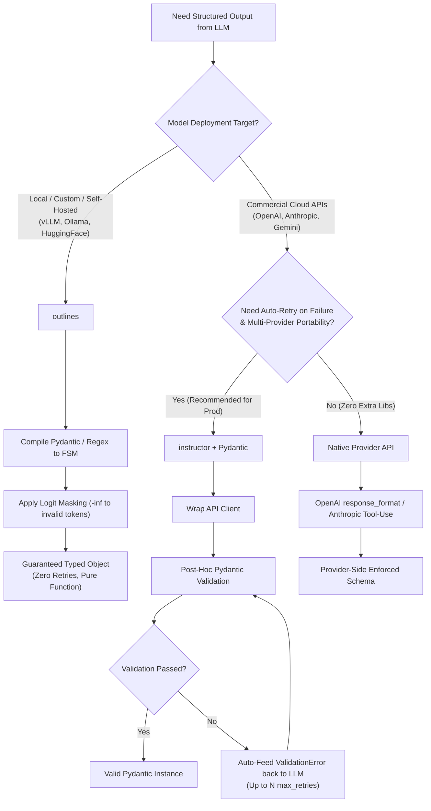
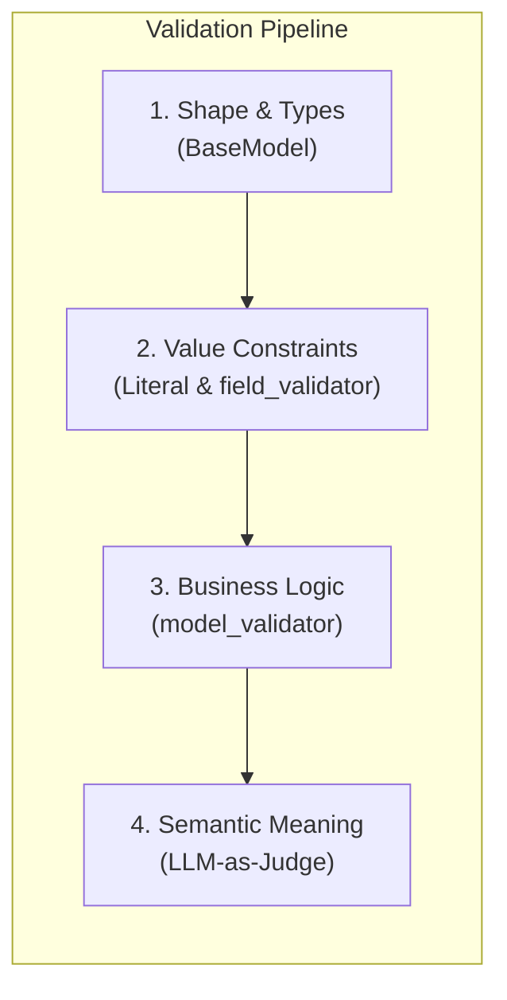

# Structured LLM Outputs: A Study Guide

**Topic:** Enforcing structured, reliable outputs from LLMs — from Pydantic basics to production patterns.

---

## 📊 Visual Summary & Decision Tree



### Concentric Validation Pipeline



---

## 1. The Core Problem

When you ask an LLM to return structured data (JSON, YAML, etc.) via a plain prompt, the output is **non-deterministic prose** — not a guaranteed data structure. The model may:

- Wrap JSON in markdown fences (` ```json ... ``` `)
- Add preamble text like *"Sure! Here is the JSON:"*
- Hallucinate extra fields or omit required ones
- Change formatting across model versions silently

Developers historically used `regex` or `json.loads()` to parse this. This is **fragile and an antipattern** in production.

```python
# ❌ Fragile antipattern
response_text = llm.complete("Return JSON with name and age")
match = re.search(r'```json\n(.*?)\n```', response_text, re.DOTALL)
data = json.loads(match.group(1))  # Breaks constantly
```

---

## 2. The Modern Solution: Schema-Enforced at the API Boundary

All major providers (OpenAI, Anthropic, Google) now support native structured output. The model is constrained **at token-generation time** — it cannot produce output that violates the schema.

### OpenAI (`response_format` / `.parse()`)

```python
from openai import OpenAI
from pydantic import BaseModel

class Person(BaseModel):
    name: str
    age: int

client = OpenAI()
response = client.beta.chat.completions.parse(
    model="gpt-4o",
    messages=[{"role": "user", "content": "Alice is 30 years old."}],
    response_format=Person,  # Schema enforced at generation time
)

person = response.choices[0].message.parsed  # Already a Person object ✅
```

### Anthropic (Tool-Use pattern)

Anthropic doesn't have a native `response_format`. The pattern is to define a tool with your schema and force the model to call it:

```python
from anthropic import Anthropic
from pydantic import BaseModel

class Person(BaseModel):
    name: str
    age: int

client = Anthropic()
response = client.messages.create(
    model="claude-sonnet-4-5",
    tools=[{
        "name": "extract_person",
        "description": "Extract person details",
        "input_schema": Person.model_json_schema()
    }],
    tool_choice={"type": "tool", "name": "extract_person"},
    messages=[{"role": "user", "content": "Alice is 30 years old."}]
)

data = response.content[0].input  # Dict — guaranteed schema-valid
person = Person(**data)           # Pydantic object ✅
```

---

## 3. Where Pydantic Alone Falls Short

Pydantic validates **shape and type**. It does NOT validate **meaning or business logic**.

### 3.1 Enumerated Values — Use `Literal` Not `str`

```python
# ❌ Pydantic accepts any string — model invents values
class Sentiment(BaseModel):
    label: str        # passes "totally_made_up_label" silently

# ✅ Constrain at schema level with Literal
from typing import Literal

class Sentiment(BaseModel):
    label: Literal["positive", "negative", "neutral"]  # Enforced by provider
    score: float
```

### 3.2 Value Range Validation — Use `@field_validator`

```python
from pydantic import field_validator

class Sentiment(BaseModel):
    label: Literal["positive", "negative", "neutral"]
    score: float

    @field_validator("score")
    def score_in_range(cls, v):
        if not 0.0 <= v <= 1.0:
            raise ValueError("Score must be 0.0–1.0")
        return v
```

### 3.3 Cross-Field Business Logic — Use `@model_validator`

```python
from pydantic import model_validator

class OrderStatus(BaseModel):
    status: Literal["pending", "shipped", "delivered"]
    tracking_number: str | None = None

    @model_validator(mode="after")
    def shipped_requires_tracking(self):
        if self.status == "shipped" and not self.tracking_number:
            raise ValueError("tracking_number is required when status is 'shipped'")
        return self
```

### 3.4 Dynamic Schemas (Unknown at Compile Time)

When schema fields are determined at runtime (e.g., user uploads a CSV), you can't define a static Pydantic model. Build JSON schema programmatically:

```python
def make_extraction_schema(columns: list[str]) -> dict:
    return {
        "type": "object",
        "properties": {col: {"type": "string"} for col in columns},
        "required": columns,
        "additionalProperties": False
    }

schema = make_extraction_schema(["company_name", "revenue", "year"])
# Pass directly to the API as a raw JSON schema
```

---

## 4. The `instructor` Library — The Missing Layer ⭐

**`instructor`** is the single most impactful upgrade on top of Pydantic. It wraps any LLM client and adds:

1. **Automatic retry on `ValidationError`** — feeds the Pydantic error back to the model and asks it to fix its output.
2. **Works with all major providers** — OpenAI, Anthropic, Google, Mistral, and local models via Ollama.
3. **Streaming support** — yields partially valid Pydantic objects progressively.

```
pip install instructor
```

### Basic Usage (Anthropic)

```python
import instructor
from anthropic import Anthropic
from pydantic import BaseModel

client = instructor.from_anthropic(Anthropic())

class Person(BaseModel):
    name: str
    age: int

# If the model returns invalid JSON or fails validation,
# instructor automatically retries (up to max_retries times)
person = client.messages.create(
    model="claude-sonnet-4-5",
    max_tokens=1024,
    max_retries=3,           # Auto-retry on ValidationError
    response_model=Person,
    messages=[{"role": "user", "content": "Alice is 30 years old."}]
)

print(person.name)  # "Alice"
print(person.age)   # 30
```

### How the Retry Loop Works

When validation fails, `instructor` sends the `ValidationError` message back to the model:

```
Turn 1: "Return a Person object for Alice who is 30."
→ Model: {"name": "Alice", "age": "thirty"}  ← ValidationError: age must be int

Turn 2 (auto): "Your previous response failed validation:
               age: value is not a valid integer. Please fix and return valid JSON."
→ Model: {"name": "Alice", "age": 30}  ← ✅ Valid
```

### Streaming with Partial Objects

```python
import instructor
from openai import OpenAI
from pydantic import BaseModel
from instructor import Partial

client = instructor.from_openai(OpenAI())

class Report(BaseModel):
    title: str
    summary: str
    key_findings: list[str]

# Stream partial objects as they're generated
for partial_report in client.chat.completions.create_partial(
    model="gpt-4o",
    response_model=Partial[Report],
    messages=[{"role": "user", "content": "Analyze quarterly sales data."}]
):
    print(partial_report)  # Progressively valid partial objects
```

---

## 5. Validation Tiers — A Mental Model

Think of validation as four concentric layers:

| Layer | What It Validates | How |
|---|---|---|
| **Shape** | Correct fields, correct types | `BaseModel` field definitions |
| **Value Contract** | Valid enums, numeric ranges | `Literal`, `@field_validator` |
| **Business Logic** | Cross-field conditional rules | `@model_validator` |
| **Semantic Meaning** | Does the value make logical sense? | LLM-as-judge (second model call) |

Pydantic covers layers 1–3. Layer 4 requires a second validation call.

### LLM-as-Judge (Semantic Validation)

For cases where structure is valid but meaning is wrong:

```python
def validate_semantics(output: dict, original_query: str, cheap_model) -> bool:
    judge_prompt = f"""
    Original query: {original_query}
    Model output: {output}

    Is this output a faithful, accurate, and sensible response to the query?
    Respond with only: PASS or FAIL and a one-line reason.
    """
    result = cheap_model.complete(judge_prompt)
    return result.strip().startswith("PASS")
```

> Use a cheap/fast model (Flash, Haiku) for the judge — not the expensive frontier model.

---

## 6. Token-Level Constrained Generation: `outlines`

**`outlines`** is indeed a very clean and natural alternative. Instead of wrapping an API call post-hoc or running retry loops, `outlines` compiles a Pydantic model, Regex, or JSON Schema into an **Index / Finite State Machine (FSM)**. 

You bind this FSM to the model to construct a specialized generator function:

```python
import outlines
from pydantic import BaseModel
from typing import Literal

class Sentiment(BaseModel):
    label: Literal["positive", "negative", "neutral"]
    score: float

# 1. Load model runtime (HuggingFace, vLLM, Ollama, llama.cpp)
model = outlines.models.transformers("mistralai/Mistral-7B-v0.1")

# 2. Build a specialized generator bound to the Pydantic schema
generator = outlines.generate.json(model, Sentiment)

# 3. Call the generator directly — returns a typed Pydantic object natively on 1st try!
result = generator("The product is amazing and exceeded expectations.")
print(type(result))  # <class '__main__.Sentiment'>
print(result.label)  # 'positive'
```

### Why Outlines Feels So Natural

1. **Ergonomic Signature:** `generator(prompt)` acts as a pure function that returns your Pydantic object directly.
2. **Zero Retry Latency:** It applies **token-level logit masking**. At every single generation step, token logits for characters that would violate the JSON schema or Pydantic types are set to $-\infty$. The model *mathematically cannot choose an invalid token*.
3. **Versatility Beyond Pydantic:** You can use `outlines.generate.regex(model, r"([0-9]{3})-[0-9]{4}")` or `outlines.generate.choice(model, ["yes", "no"])` to enforce non-JSON formats just as easily.

### Outlines vs. Instructor vs. Native Provider APIs

| Feature | `outlines` | `instructor` | Native (`response_format`) |
|---|---|---|---|
| **Mechanism** | Token logit masking (FSM/Grammar) | Pydantic validation + API retry prompt loop | Provider-side logit masking / tool calling |
| **Primary Target** | Local / Self-hosted (vLLM, HF, Ollama) | Cloud APIs (OpenAI, Anthropic, Gemini) | Specific Provider Cloud API |
| **Retry Needed?** | ❌ No (Guaranteed on 1st try) | ⚠️ Yes (If 1st attempt fails validation) | ❌ Rarely (Provider handled) |
| **Developer API** | `generator(prompt) -> Object` | `client.create(response_model=Model)` | `client.parse(response_format=Model)` |
| **Raw Logit Access Required?** | Yes (Needs low-level token probabilities) | No (Works over standard HTTP chat APIs) | Handled server-side by provider |


---

## 7. Tool/Framework Comparison

| Tool | Best For | Approach |
|---|---|---|
| **Pydantic** | Schema definition, type/field validation | Post-generation validation |
| **`instructor`** | Production robustness, auto-retry | Retry loop with error feedback to model |
| **`outlines`** | Local/open-source models | Token-level constrained decoding |
| **`guidance`** (Microsoft) | Complex conditional generation logic | Interleaved generation + constraints |
| **Native provider** (`response_format`, tool-use) | Zero-dependency enforcement | Schema enforced during generation |

---

## 8. Recommended Stack (Tiered)

### ✅ Tier 1: Default (90% of cases)
```
Pydantic model + instructor + Native provider structured output
```
- Define schema as a Pydantic `BaseModel`
- Wrap client with `instructor.from_<provider>()`
- Use `Literal` for all enumerated fields
- Add `@field_validator` for numeric ranges and format checks
- Add `@model_validator` for cross-field rules
- Set `max_retries=3` in instructor calls

### Tier 2: Custom / Self-Hosted / Local Models (vLLM, Ollama, HuggingFace)
```
Pydantic model + outlines constrained decoding generator
```
> 💡 **Why `outlines` is preferred here:** When working with self-hosted or custom models, `outlines` gives you maximum low-level control, zero-retry token-masking guarantees, and high-throughput fast inference without relying on cloud provider API wrappers.

### Tier 3: High-Stakes Outputs
```
Tier 1 + LLM-as-judge second call with cheap model
```

---

## 9. Anti-Patterns to Avoid

| ❌ Antipattern | ✅ Fix |
|---|---|
| `json.loads(response.text)` | Use native `response_format` or instructor |
| `re.search(r'```json...')` regex parsing | Schema-enforced at API boundary |
| `label: str` for enum fields | `label: Literal["a", "b", "c"]` |
| Validating after data propagated downstream | Validate at the API call boundary |
| Using expensive model as judge | Use Flash/Haiku for semantic validation |
| No retry on validation failure | Wrap with `instructor` |

---

## 10. Key Principle

> **The API call boundary is where you have maximum leverage.**
> Enforce the contract there — at generation time — not 3 lines later with a `try/except`.
> A `ValidationError` at the boundary is always better than corrupted data silently propagating into your agent's next step.

---

## References & Further Reading

- [`instructor` library docs](https://python.useinstructor.com/)
- [`outlines` library docs](https://dottxt-ai.github.io/outlines/)
- [OpenAI Structured Outputs guide](https://platform.openai.com/docs/guides/structured-outputs)
- [Anthropic Tool Use guide](https://docs.anthropic.com/en/docs/build-with-claude/tool-use)
- [Pydantic validators docs](https://docs.pydantic.dev/latest/concepts/validators/)

---

## 🔍 Section 11: Keywords & Concepts for Deep-Dive Study

Here is a curated index of advanced concepts and keywords underlying structured LLM generation to explore in future research:

1. **Finite State Machines (FSM) & Pushdown Automata:** How formal language grammars index JSON schemas to control state transitions during text generation.
2. **Logit Masking / Logit Bias ($-\infty$ Logits):** The technique of setting logit values of illegal next tokens to negative infinity before softmax sampling.
3. **Context-Free Grammars (CFG) & GBNF (GGML Backus-Naur Form):** Grammar definition formats used by runtimes like `llama.cpp` and `vLLM` to restrict sampling to valid syntaxes.
4. **Constrained Decoding Engines (`XGrammar`, `Outlines`, `Guidance`):** Specialized C++/Rust acceleration libraries built into serving engines for high-throughput constrained inference.
5. **JSON Schema Draft 2020-12 / OpenAPI 3.1 Specs:** The standard JSON serialization targets used by LLM API boundaries.
6. **Instructor Mode Strategies (`TOOLS`, `JSON`, `JSON_SCHEMA`, `MD_JSON`):** The underlying implementation modes `instructor` uses depending on whether a model supports tool calling or raw JSON output.
7. **Pydantic V2 `pydantic-core` (Rust Validation):** Understanding ultra-fast schema serialization and runtime validation mechanics.
8. **LLM-as-Judge & Guardrails (Guardrails AI, NeMo Guardrails):** Frameworks for combining structural schema enforcement with behavioral and semantic guardrails.
