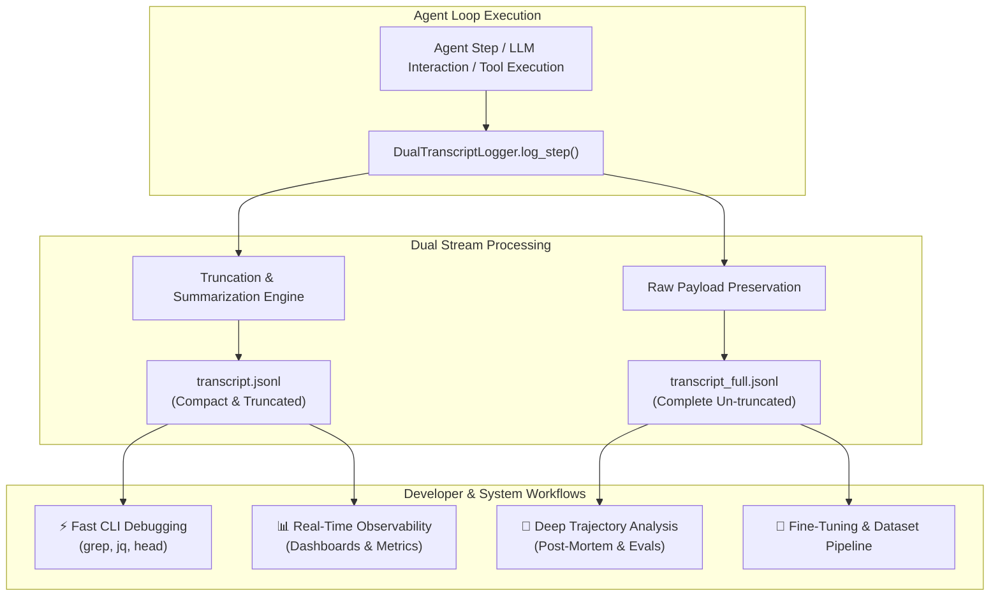
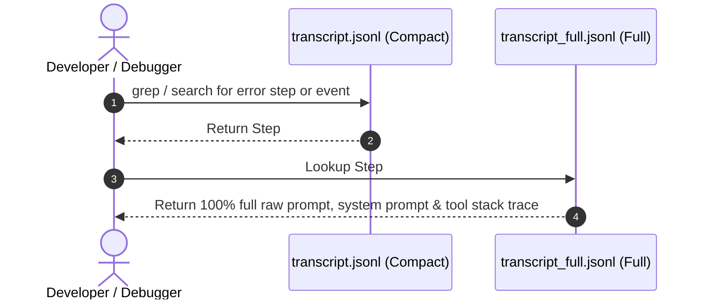
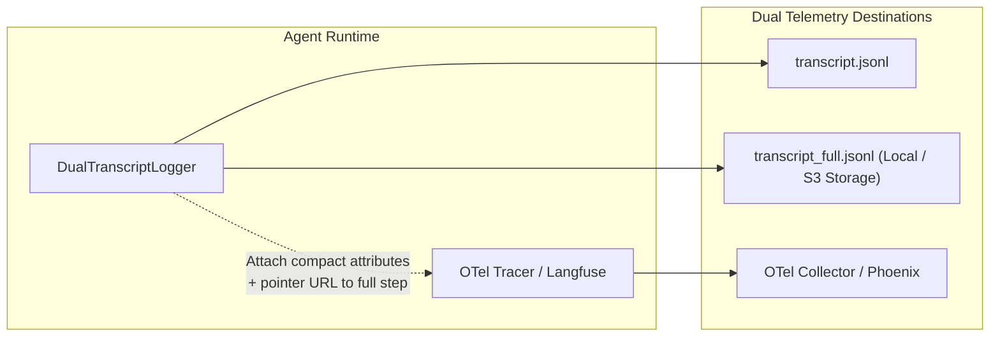

# Telemetry & Dual Transcripts Guide: Agent Observability at Scale

**Topic:** Architecture, schema specification, and production implementation of the Dual Transcript Strategy (`transcript.jsonl` and `transcript_full.jsonl`) for agentic AI telemetry.

---

## 📊 Visual Summary & Architecture



### Step Index Synchronization & Lookup Flow



---

## 1. The Core Engineering Challenge

In production agentic AI systems, every execution turn generates massive amounts of data:
- System prompts with injected dynamic SOPs (tens of thousands of tokens)
- Full conversation histories and context windows
- Large tool payloads (file read outputs, directory trees, code diffs, API responses)
- Verbose model reasoning/thinking chains (e.g., `<thought>` blocks)

Logging this volume of data presents an architectural dilemma:

| Logging Approach | Pros | Cons |
| :--- | :--- | :--- |
| **Monolithic Full Logging** | Single source of truth, no lost context. | Massive disk/network footprint, slow searches, expensive OTel ingress, unreadable `tail -f` outputs. |
| **Aggressive Truncation Only** | Fast, lightweight, cheap storage, easy to read in terminals. | Blind spots during failures, impossible to recreate exact LLM prompts, breaks fine-tuning dataset generation. |

### The Solution: Dual Transcript Strategy (Rule #9 Compliance)

The **Dual Transcript Strategy** splits telemetry output into two synchronized files:

1. **`transcript.jsonl` (Lightweight / Compact)**: High-level structured stream. Text fields and payloads exceeding a configurable limit (e.g., 250 chars) are safely truncated with `is_truncated: true`. Ideal for real-time monitoring, metric calculation, fast terminal inspection, and lightweight index lookups.
2. **`transcript_full.jsonl` (Complete / Raw Payload)**: Complete raw record. Preserves the exact, untruncated system prompts, tool inputs/outputs, and LLM responses token-for-token. Ideal for deep post-mortems, prompt regression testing, offline evals, and dataset generation.

---

## 2. Dual Transcript Schemas & Specifications

To ensure seamless navigation between the compact and full records, both JSON Lines streams share identical core structural identifiers.

### Core Schema Rules
1. **Strict 1-to-1 Indexing**: Each line in `transcript.jsonl` corresponds to the exact line number and `step_index` in `transcript_full.jsonl`.
2. **Correlation Identifiers**: Every record includes `conversation_id`, `run_id`, `step_index`, and `step_id`.
3. **Explicit Truncation Metadata**: The compact record explicitly sets `is_truncated: true` and includes `truncated_fields` so parsers know when to pull full payloads.

### Schema Structure Comparison

```
transcript.jsonl (Compact)                       transcript_full.jsonl (Full)
┌───────────────────────────────────────┐        ┌───────────────────────────────────────┐
│ step_index: 14                        │        │ step_index: 14                        │
│ timestamp: "2026-07-24T11:42:00Z"     │        │ timestamp: "2026-07-24T11:42:00Z"     │
│ source: "MODEL"                       │        │ source: "MODEL"                       │
│ type: "TOOL_CALL"                     │        │ type: "TOOL_CALL"                     │
│ is_truncated: true                    │        │ is_truncated: false                   │
│ truncated_fields: ["content","args"]  │        │ truncated_fields: []                  │
│ summary: "Executed view_file"         │        │ content: "<full 50KB code file>"      │
│ content: "def main():\n  # [450 ...]" │        │ args: { "path": "src/main.py", ... }  │
└───────────────────────────────────────┘        └───────────────────────────────────────┘
```

---

## 3. Production Python Implementation

Here is a complete, thread-safe production implementation of the `DualTranscriptLogger`.

```python
"""
dual_transcript_logger.py

Production implementation of the Dual Transcript Telemetry Strategy.
Generates synchronized `transcript.jsonl` (compact) and `transcript_full.jsonl` (raw) logs.
"""

from dataclasses import dataclass, field, asdict
from datetime import datetime, timezone
import json
import os
from pathlib import Path
import threading
from typing import Any, Dict, List, Optional, Union


@dataclass
class TranscriptStep:
    conversation_id: str
    run_id: str
    step_index: int
    step_id: str
    timestamp: str
    source: str  # USER, MODEL, SYSTEM, TOOL
    type: str    # USER_INPUT, PLANNER_RESPONSE, TOOL_CALL, TOOL_RESULT, ERROR
    status: str  # PENDING, DONE, ERROR
    summary: str
    content: Any
    tool_calls: List[Dict[str, Any]] = field(default_factory=list)
    metadata: Dict[str, Any] = field(default_factory=dict)
    is_truncated: bool = False
    truncated_fields: List[str] = field(default_factory=list)

    def to_dict(self) -> Dict[str, Any]:
        return asdict(self)


class TruncationEngine:
    """Recursively truncates large text fields, lists, and dicts for compact transcripts."""

    def __init__(self, max_string_len: int = 250, max_list_items: int = 5):
        self.max_string_len = max_string_len
        self.max_list_items = max_list_items

    def truncate_value(self, val: Any, field_name: str = "") -> tuple[Any, bool]:
        """Returns (truncated_value, did_truncate)."""
        if isinstance(val, str):
            if len(val) > self.max_string_len:
                truncated_str = (
                    val[: self.max_string_len]
                    + f"... [Truncated {len(val) - self.max_string_len} chars]"
                )
                return truncated_str, True
            return val, False

        elif isinstance(val, dict):
            new_dict = {}
            any_truncated = False
            for k, v in val.items():
                trunc_v, was_trunc = self.truncate_value(v, f"{field_name}.{k}")
                new_dict[k] = trunc_v
                if was_trunc:
                    any_truncated = True
            return new_dict, any_truncated

        elif isinstance(val, list):
            new_list = []
            any_truncated = False
            items_to_process = val[: self.max_list_items]
            for item in items_to_process:
                trunc_item, was_trunc = self.truncate_value(item, field_name)
                new_list.append(trunc_item)
                if was_trunc:
                    any_truncated = True

            if len(val) > self.max_list_items:
                new_list.append(f"... [{len(val) - self.max_list_items} items omitted]")
                any_truncated = True

            return new_list, any_truncated

        return val, False


class DualTranscriptLogger:
    """Thread-safe Logger managing synchronized compact and full transcript files."""

    def __init__(
        self,
        log_dir: Union[str, Path],
        conversation_id: str,
        run_id: str,
        max_string_len: int = 250,
    ):
        self.log_dir = Path(log_dir)
        self.log_dir.mkdir(parents=True, exist_ok=True)

        self.conversation_id = conversation_id
        self.run_id = run_id
        self.compact_path = self.log_dir / "transcript.jsonl"
        self.full_path = self.log_dir / "transcript_full.jsonl"

        self.truncation_engine = TruncationEngine(max_string_len=max_string_len)
        self._lock = threading.Lock()
        self._step_counter = 0

    def log_step(
        self,
        source: str,
        step_type: str,
        content: Any,
        summary: str = "",
        status: str = "DONE",
        tool_calls: Optional[List[Dict[str, Any]]] = None,
        metadata: Optional[Dict[str, Any]] = None,
    ) -> TranscriptStep:
        """Logs a single turn/step to both transcript files synchronously and atomically."""
        with self._lock:
            self._step_counter += 1
            current_step_idx = self._step_counter
            step_id = f"step-{current_step_idx:04d}"
            iso_timestamp = datetime.now(timezone.utc).isoformat()

            tool_calls = tool_calls or []
            metadata = metadata or {}

            # Construct raw full step
            full_step = TranscriptStep(
                conversation_id=self.conversation_id,
                run_id=self.run_id,
                step_index=current_step_idx,
                step_id=step_id,
                timestamp=iso_timestamp,
                source=source,
                type=step_type,
                status=status,
                summary=summary or f"{source} {step_type}",
                content=content,
                tool_calls=tool_calls,
                metadata=metadata,
                is_truncated=False,
                truncated_fields=[],
            )

            # Construct compact step via truncation
            truncated_fields = []
            compact_content, content_truncated = self.truncation_engine.truncate_value(
                content, "content"
            )
            if content_truncated:
                truncated_fields.append("content")

            compact_tool_calls, tools_truncated = self.truncation_engine.truncate_value(
                tool_calls, "tool_calls"
            )
            if tools_truncated:
                truncated_fields.append("tool_calls")

            compact_metadata, meta_truncated = self.truncation_engine.truncate_value(
                metadata, "metadata"
            )
            if meta_truncated:
                truncated_fields.append("metadata")

            compact_step = TranscriptStep(
                conversation_id=self.conversation_id,
                run_id=self.run_id,
                step_index=current_step_idx,
                step_id=step_id,
                timestamp=iso_timestamp,
                source=source,
                type=step_type,
                status=status,
                summary=summary or f"{source} {step_type}",
                content=compact_content,
                tool_calls=compact_tool_calls,
                metadata=compact_metadata,
                is_truncated=len(truncated_fields) > 0,
                truncated_fields=truncated_fields,
            )

            # Append to full transcript file
            with open(self.full_path, "a", encoding="utf-8") as f_full:
                f_full.write(json.dumps(full_step.to_dict(), ensure_ascii=False) + "\n")

            # Append to compact transcript file
            with open(self.compact_path, "a", encoding="utf-8") as f_compact:
                f_compact.write(json.dumps(compact_step.to_dict(), ensure_ascii=False) + "\n")

            return compact_step

    def get_full_step(self, step_index: int) -> Optional[Dict[str, Any]]:
        """Retrieves a specific step from transcript_full.jsonl by index."""
        if not self.full_path.exists():
            return None

        with open(self.full_path, "r", encoding="utf-8") as f:
            for line in f:
                if not line.strip():
                    continue
                record = json.loads(line)
                if record.get("step_index") == step_index:
                    return record
        return None
```

---

## 4. Usage Example & Fast Retrieval Workflows

### 1. Logging Execution Steps in an Agent Loop

```python
# Initialize Logger for a conversation session
logger = DualTranscriptLogger(
    log_dir="./logs/session_abc123",
    conversation_id="conv-456",
    run_id="run-789",
    max_string_len=200,
)

# Log heavy user prompt with massive context block
logger.log_step(
    source="USER",
    step_type="USER_INPUT",
    content="Execute system refactoring on module X:\n" + ("A" * 5000),  # Long content
    summary="User initiated refactoring task",
)

# Log tool call response with 100KB source code view
logger.log_step(
    source="TOOL",
    step_type="TOOL_RESULT",
    content={"file_path": "main.py", "source": "def foo():\n" + ("print('bar')\n" * 1000)},
    summary="Executed view_file on main.py",
    metadata={"tokens_returned": 14200, "duration_ms": 120},
)
```

### 2. Inspecting Log Files from CLI

Developers can quickly inspect compact transcripts without flooding their terminals:

```bash
# 1. Quickly list high-level step summaries and check for errors
jq -c '{step: .step_index, source: .source, type: .type, summary: .summary, truncated: .is_truncated}' logs/session_abc123/transcript.jsonl

# Output:
# {"step":1,"source":"USER","type":"USER_INPUT","summary":"User initiated refactoring task","truncated":true}
# {"step":2,"source":"TOOL","type":"TOOL_RESULT","summary":"Executed view_file on main.py","truncated":true}

# 2. Extract full payload ONLY for step #2 when debugging
grep '"step_index":2' logs/session_abc123/transcript_full.jsonl | jq .content
```

---

## 5. Integrating Dual Transcripts with OpenTelemetry & LLM Tracing

When exporting agent execution traces to platforms like **Arize Phoenix**, **Langfuse**, or **Datadog / OpenTelemetry Collector**, streaming multi-megabyte payloads on every span attribute causes high network latency and API bandwidth caps.

### Recommended OpenTelemetry Mapping Pattern



#### Code Pattern for OTel Span Annotation

```python
from opentelemetry import trace

tracer = trace.get_tracer("agent.telemetry")

def execute_agent_step(logger: DualTranscriptLogger, step_data: dict):
    # Log to dual transcripts locally/storage
    compact_step = logger.log_step(
        source=step_data["source"],
        step_type=step_data["type"],
        content=step_data["content"],
        summary=step_data["summary"],
    )

    # Attach to OpenTelemetry Span efficiently
    with tracer.start_as_current_span(f"agent_step_{compact_step.step_index}") as span:
        # 1. Attach compact fields directly to span attributes
        span.set_attribute("gen_ai.step_index", compact_step.step_index)
        span.set_attribute("gen_ai.source", compact_step.source)
        span.set_attribute("gen_ai.summary", compact_step.summary)
        span.set_attribute("gen_ai.is_truncated", compact_step.is_truncated)
        
        # 2. Attach compact preview content
        span.set_attribute("gen_ai.content_preview", str(compact_step.content))
        
        # 3. Provide direct URI pointer to full transcript payload for deep link investigation
        span.set_attribute(
            "gen_ai.full_payload_uri",
            f"s3://agent-telemetry-logs/{compact_step.conversation_id}/transcript_full.jsonl#line={compact_step.step_index}"
        )
```

---

## 6. Retention, Storage Tiering & Production Operations

To keep operational storage costs minimal while retaining total debuggability:

| Log Type | Active Window (0 - 14 Days) | Medium Window (15 - 90 Days) | Long Term (90+ Days) |
| :--- | :--- | :--- | :--- |
| **`transcript.jsonl`** | Hot local SSD / ElasticSearch index | Warm Object Storage (S3 Standard) | Retained for aggregate analytics & historical search |
| **`transcript_full.jsonl`** | Hot local SSD for active debugging | Cold Storage (S3 Glacier Instant Retrieval) | Filtered for evals & fine-tuning datasets, archived/purged |

### Automated S3 Sync / Cleanup Script Concept

```bash
#!/bin/bash
# Sync completed conversation session logs to S3 with tiered storage classes

SESSION_DIR=$1
CONV_ID=$(basename "$SESSION_DIR")

# Upload compact transcripts to Standard storage for fast querying
aws s3 cp "$SESSION_DIR/transcript.jsonl" "s3://agent-telemetry-logs/$CONV_ID/transcript.jsonl" --storage-class STANDARD

# Upload full transcripts to Glacier Instant Retrieval to save 68% storage cost
aws s3 cp "$SESSION_DIR/transcript_full.jsonl" "s3://agent-telemetry-logs/$CONV_ID/transcript_full.jsonl" --storage-class GLACIER_IR
```

---

## 7. Summary & Architectural Best Practices Checklist

- ✅ **Always index synchronized steps**: Guarantee `step_index` match between `transcript.jsonl` and `transcript_full.jsonl`.
- ✅ **Include truncation flags**: Set `is_truncated: true` and list `truncated_fields` on compact steps.
- ✅ **Keep file I/O thread-safe**: Use locks or async queues so concurrent step updates do not interleave JSON lines.
- ✅ **Decouple OTel tracing payloads**: Put compact summaries on OpenTelemetry span attributes; point to full log URIs for deep analysis.
- ✅ **Filter full transcripts for evals**: Use `transcript_full.jsonl` trajectories to build high-quality fine-tuning pairs and benchmark datasets.
