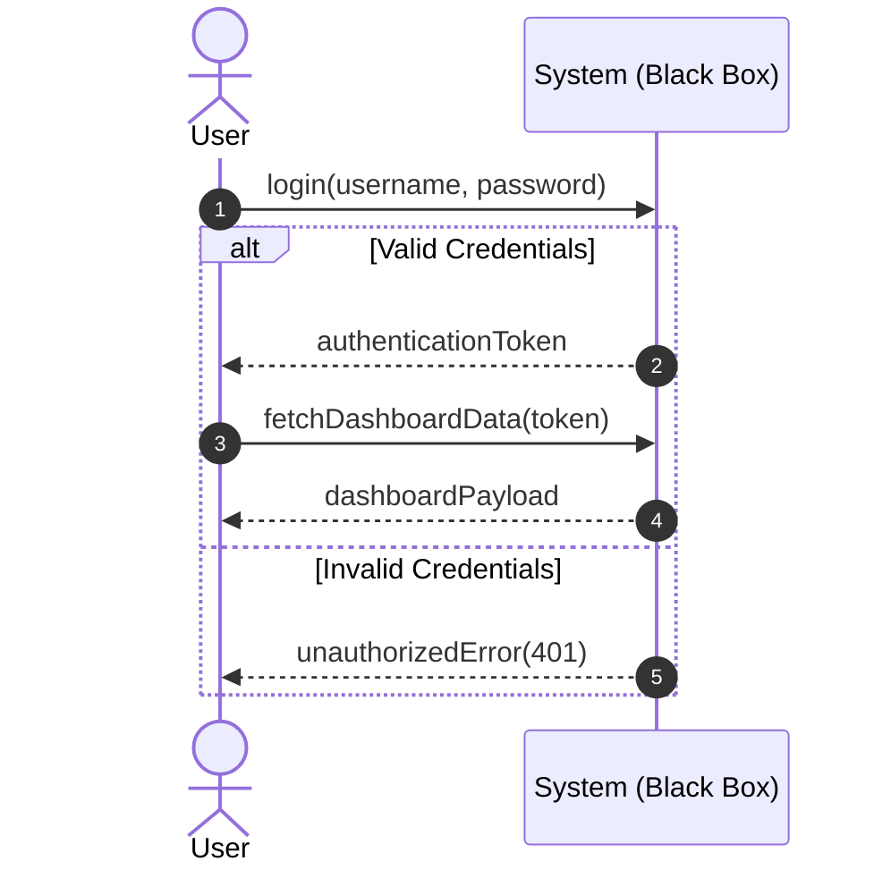

# System Sequence Diagram (SSD) & System Specification Design Analysis

## 1. What is SSD Analysis?
In software engineering, **SSD** typically refers to **System Sequence Diagram** or **System Specification Design**. 

Both concepts are critical analysis phases:
- **System Sequence Diagrams (SSD):** Visual representations that show, for a particular scenario of a use case, the events that external actors generate, their order, and inter-system events.
- **System Specification Design (SSD) Analysis:** The technical analysis phase that evaluates architectural feasibility, bottlenecks, constraints, and data flows before drafting detailed component designs.

---

## 2. System Sequence Diagram (SSD) Analysis

An SSD describes the system as a "black box" and focuses on the inputs/outputs across the system boundary.

### 2.1 Key Elements
- **Actors:** External entities (users, external services, hardware devices) interacting with the system.
- **System Boundary:** The system itself represented as a single lifeline box.
- **System Events:** Inputs (requests/calls) sent from actors to the system, and outputs (responses/data) returned to actors.

### 2.2 Standard Mermaid SSD Example

### 2.3 Objectives of SSD Analysis
- Identify the explicit **API operations** the system must expose.
- Establish clear boundaries between actors and system behaviors.
- Ensure all business requirements from use-case scenarios map to concrete events.

---

## 3. System Specification & Design (SSD) Technical Analysis

When analyzing a system specification, designers evaluate technical feasibility and performance characteristics.

### 3.1 Components of Specification Analysis
- **Throughput & Capacity Planning:** Analyzing transaction per second (TPS) requirements, database write/read ratios, and storage sizes.
- **Dependency Mapping:** Reviewing third-party integrations, downstream rate limits, and fallback strategies (circuit breakers).
- **Security & Threat Modeling:** Identifying entry points, data classification, and authorization rules.
- **Trade-off Analysis:** Evaluating options (e.g., SQL vs. NoSQL, polling vs. WebSockets) using a structural decision matrix.

---

## 4. How to Use and Maintain SSD Analysis Artifacts
- **Keep SSDs Close to Use Cases:** Whenever a product specification changes, update the SSD first to ensure developers understand the new API/event sequences.
- **Review before API design:** Use the system events defined in your SSDs as the primary template for defining REST endpoints, gRPC services, or message queues.
